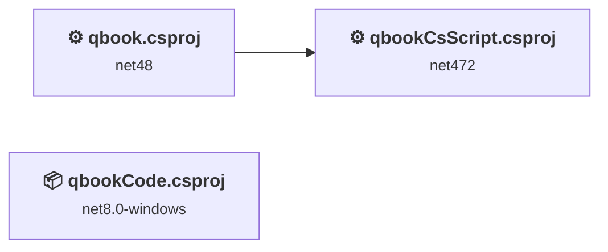
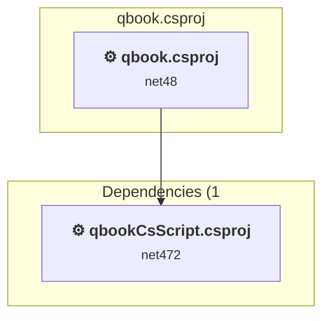
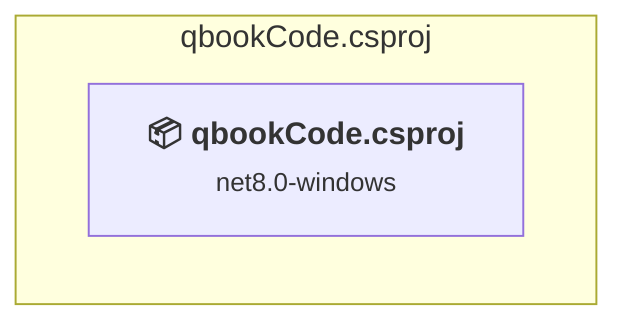
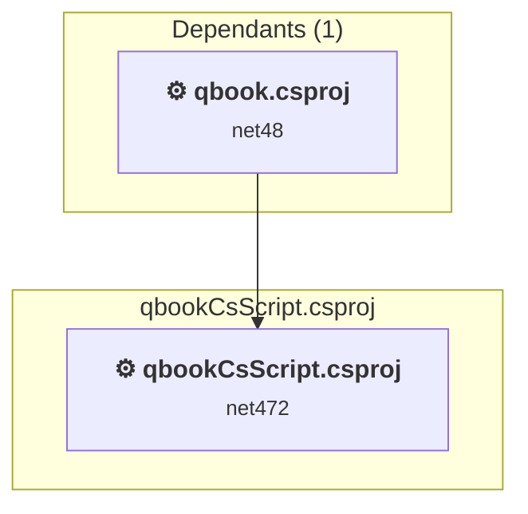

# Projects and dependencies analysis

This document provides a comprehensive overview of the projects and their dependencies in the context of upgrading to .NETCoreApp,Version=v10.0.

## Table of Contents

- [Executive Summary](#executive-Summary)
  - [Highlevel Metrics](#highlevel-metrics)
  - [Projects Compatibility](#projects-compatibility)
  - [Package Compatibility](#package-compatibility)
  - [API Compatibility](#api-compatibility)
  - [Binding Redirect Configuration](#binding-redirect-configuration)
- [Aggregate NuGet packages details](#aggregate-nuget-packages-details)
- [Top API Migration Challenges](#top-api-migration-challenges)
  - [Technologies and Features](#technologies-and-features)
  - [Most Frequent API Issues](#most-frequent-api-issues)
- [Projects Relationship Graph](#projects-relationship-graph)
- [Project Details](#project-details)

  - [qbook\qbook.csproj](#qbookqbookcsproj)
  - [qbookCode\qbookCode.csproj](#qbookcodeqbookcodecsproj)
  - [qbookCsScript\qbookCsScript.csproj](#qbookcsscriptqbookcsscriptcsproj)

## Executive Summary

### Highlevel Metrics

| Metric | Count | Status |
| :--- | :---: | :--- |
| Total Projects | 3 | All require upgrade |
| Total NuGet Packages | 167 | 52 need upgrade |
| Total Code Files | 246 |  |
| Total Code Files with Incidents | 164 |  |
| Total Lines of Code | 78532 |  |
| Total Number of Issues | 27394 |  |
| Estimated LOC to modify | 27037+ | at least 34,4% of codebase |

### Projects Compatibility

| Project | Target Framework | Difficulty | Package Issues | API Issues | Binding Issues | Est. LOC Impact | Description |
| :--- | :---: | :---: | :---: | :---: | :---: | :---: | :--- |
| [qbook\qbook.csproj](#qbookqbookcsproj) | net48 | 🟡 Medium | 82 | 12282 | 132 | 12282+ | ClassicWpf, Sdk Style = False |
| [qbookCode\qbookCode.csproj](#qbookcodeqbookcodecsproj) | net8.0-windows | 🟡 Medium | 2 | 9093 | 0 | 9093+ | WinForms, Sdk Style = True |
| [qbookCsScript\qbookCsScript.csproj](#qbookcsscriptqbookcsscriptcsproj) | net472 | 🟡 Medium | 48 | 5662 | 88 | 5662+ | ClassicWpf, Sdk Style = False |

### Package Compatibility

| Status | Count | Percentage |
| :--- | :---: | :---: |
| ✅ Compatible | 115 | 68,9% |
| ⚠️ Incompatible | 10 | 6,0% |
| 🔄 Upgrade Recommended | 42 | 25,1% |
| ***Total NuGet Packages*** | ***167*** | ***100%*** |

### API Compatibility

| Category | Count | Impact |
| :--- | :---: | :--- |
| 🔴 Binary Incompatible | 22020 | High - Require code changes |
| 🟡 Source Incompatible | 5008 | Medium - Needs re-compilation and potential conflicting API error fixing |
| 🔵 Behavioral change | 9 | Low - Behavioral changes that may require testing at runtime |
| ✅ Compatible | 81566 |  |
| ***Total APIs Analyzed*** | ***108603*** |  |

### Binding Redirect Configuration

| Severity | Count | Description |
| :--- | :---: | :--- |
| 🔴Mandatory | 54 | Must be fixed to avoid runtime failures |
| 🟡Potential | 166 | May cause issues in certain scenarios |
| ***Total Binding Issues*** | ***220*** | ***Across 2 project(s)*** |

## Aggregate NuGet packages details

| Package | Current Version | Suggested Version | Projects | Description |
| :--- | :---: | :---: | :--- | :--- |
| ActiproSoftware.Controls.WinForms.Bars | 23.1.3 |  | [qbookCsScript.csproj](#qbookcsscriptqbookcsscriptcsproj) | ✅Compatible |
| ActiproSoftware.Controls.WinForms.Docking | 23.1.3 |  | [qbookCsScript.csproj](#qbookcsscriptqbookcsscriptcsproj) | ✅Compatible |
| ActiproSoftware.Controls.WinForms.Navigation | 23.1.3 |  | [qbookCsScript.csproj](#qbookcsscriptqbookcsscriptcsproj) | ✅Compatible |
| ActiproSoftware.Controls.WinForms.Shared | 23.1.3 |  | [qbookCsScript.csproj](#qbookcsscriptqbookcsscriptcsproj) | ✅Compatible |
| ActiproSoftware.Controls.WinForms.SyntaxEditor | 23.1.3 |  | [qbookCsScript.csproj](#qbookcsscriptqbookcsscriptcsproj) | ✅Compatible |
| ActiproSoftware.Controls.WinForms.SyntaxEditor.Addons.DotNet | 23.1.3 |  | [qbookCsScript.csproj](#qbookcsscriptqbookcsscriptcsproj) | ✅Compatible |
| ActiproSoftware.Controls.WinForms.Wizard | 23.1.3 |  | [qbookCsScript.csproj](#qbookcsscriptqbookcsscriptcsproj) | ✅Compatible |
| AForge | 2.2.5 |  | [qbook.csproj](#qbookqbookcsproj) [qbookCsScript.csproj](#qbookcsscriptqbookcsscriptcsproj) | ✅Compatible |
| AForge.Video | 2.2.5 |  | [qbook.csproj](#qbookqbookcsproj) [qbookCsScript.csproj](#qbookcsscriptqbookcsscriptcsproj) | ✅Compatible |
| AForge.Video.DirectShow | 2.2.5 |  | [qbook.csproj](#qbookqbookcsproj) [qbookCsScript.csproj](#qbookcsscriptqbookcsscriptcsproj) | ✅Compatible |
| Autofac | 8.2.0 |  | [qbook.csproj](#qbookqbookcsproj) [qbookCsScript.csproj](#qbookcsscriptqbookcsscriptcsproj) | ✅Compatible |
| Autofac.Extensions.DependencyInjection | 10.0.0 |  | [qbook.csproj](#qbookqbookcsproj) [qbookCsScript.csproj](#qbookcsscriptqbookcsscriptcsproj) | ✅Compatible |
| BouncyCastle.Cryptography | 2.5.1 |  | [qbook.csproj](#qbookqbookcsproj) [qbookCsScript.csproj](#qbookcsscriptqbookcsscriptcsproj) | ✅Compatible |
| cef.redist.x64 | 120.2.7 |  | [qbook.csproj](#qbookqbookcsproj) [qbookCsScript.csproj](#qbookcsscriptqbookcsscriptcsproj) | ⚠️NuGet package is deprecated |
| cef.redist.x86 | 120.2.7 |  | [qbook.csproj](#qbookqbookcsproj) [qbookCsScript.csproj](#qbookcsscriptqbookcsscriptcsproj) | ⚠️NuGet package is deprecated |
| CefSharp.Common | 141.0.110 | 86.0.241 | [qbook.csproj](#qbookqbookcsproj) [qbookCsScript.csproj](#qbookcsscriptqbookcsscriptcsproj) | ⚠️NuGet package is incompatible |
| CefSharp.Dom | 2.0.86 |  | [qbook.csproj](#qbookqbookcsproj) | ✅Compatible |
| CefSharp.WinForms | 141.0.110 | 94.4.110 | [qbook.csproj](#qbookqbookcsproj) [qbookCsScript.csproj](#qbookcsscriptqbookcsscriptcsproj) | ⚠️NuGet package is incompatible |
| chromiumembeddedframework.runtime.win-x64 | 141.0.11 |  | [qbook.csproj](#qbookqbookcsproj) [qbookCsScript.csproj](#qbookcsscriptqbookcsscriptcsproj) | ✅Compatible |
| chromiumembeddedframework.runtime.win-x86 | 141.0.11 |  | [qbook.csproj](#qbookqbookcsproj) [qbookCsScript.csproj](#qbookcsscriptqbookcsscriptcsproj) | ✅Compatible |
| CS-Script | 4.8.27 |  | [qbook.csproj](#qbookqbookcsproj) [qbookCsScript.csproj](#qbookcsscriptqbookcsscriptcsproj) | ✅Compatible |
| Dapper | 2.1.66 |  | [qbook.csproj](#qbookqbookcsproj) [qbookCsScript.csproj](#qbookcsscriptqbookcsscriptcsproj) | ✅Compatible |
| Dapper.Extensions.NetCore | 5.2.0 |  | [qbook.csproj](#qbookqbookcsproj) [qbookCsScript.csproj](#qbookcsscriptqbookcsscriptcsproj) | ✅Compatible |
| Dapper.Extensions.SQLite | 5.2.0 |  | [qbook.csproj](#qbookqbookcsproj) [qbookCsScript.csproj](#qbookcsscriptqbookcsscriptcsproj) | ✅Compatible |
| DocumentFormat.OpenXml | 2.20.0 |  | [qbookCsScript.csproj](#qbookcsscriptqbookcsscriptcsproj) | ✅Compatible |
| DynamicLanguageRuntime | 1.3.5 |  | [qbook.csproj](#qbookqbookcsproj) | ✅Compatible |
| EntityFramework | 6.5.1 | 6.5.2 | [qbook.csproj](#qbookqbookcsproj) [qbookCsScript.csproj](#qbookcsscriptqbookcsscriptcsproj) | NuGet package upgrade is recommended |
| ExCSS | 4.3.0 |  | [qbookCsScript.csproj](#qbookcsscriptqbookcsscriptcsproj) | ✅Compatible |
| Fizzler | 1.3.1 |  | [qbookCsScript.csproj](#qbookcsscriptqbookcsscriptcsproj) | ✅Compatible |
| FontAwesome.Sharp | 6.6.0 |  | [qbook.csproj](#qbookqbookcsproj) [qbookCode.csproj](#qbookcodeqbookcodecsproj) [qbookCsScript.csproj](#qbookcsscriptqbookcsscriptcsproj) | ✅Compatible |
| Google.Protobuf | 3.30.1 |  | [qbook.csproj](#qbookqbookcsproj) [qbookCsScript.csproj](#qbookcsscriptqbookcsscriptcsproj) | ✅Compatible |
| Humanizer.Core | 2.14.1 |  | [qbook.csproj](#qbookqbookcsproj) | ✅Compatible |
| IronPython | 3.4.2 |  | [qbook.csproj](#qbookqbookcsproj) | ✅Compatible |
| K4os.Compression.LZ4 | 1.3.8 |  | [qbook.csproj](#qbookqbookcsproj) [qbookCsScript.csproj](#qbookcsscriptqbookcsscriptcsproj) | ✅Compatible |
| K4os.Compression.LZ4.Streams | 1.3.8 |  | [qbook.csproj](#qbookqbookcsproj) [qbookCsScript.csproj](#qbookcsscriptqbookcsscriptcsproj) | ✅Compatible |
| K4os.Hash.xxHash | 1.0.8 |  | [qbook.csproj](#qbookqbookcsproj) [qbookCsScript.csproj](#qbookcsscriptqbookcsscriptcsproj) | ✅Compatible |
| log4net | 3.0.4 | 3.3.2 | [qbook.csproj](#qbookqbookcsproj) [qbookCsScript.csproj](#qbookcsscriptqbookcsscriptcsproj) | NuGet package contains security vulnerability |
| Microsoft.Bcl.AsyncInterfaces | 9.0.3 | 10.0.9 | [qbook.csproj](#qbookqbookcsproj) [qbookCsScript.csproj](#qbookcsscriptqbookcsscriptcsproj) | NuGet package upgrade is recommended |
| Microsoft.Bcl.HashCode | 6.0.0 |  | [qbook.csproj](#qbookqbookcsproj) [qbookCsScript.csproj](#qbookcsscriptqbookcsscriptcsproj) | ✅Compatible |
| Microsoft.Build | 17.13.9 |  | [qbook.csproj](#qbookqbookcsproj) | ✅Compatible |
| Microsoft.Build.Framework | 17.14.28 |  | [qbook.csproj](#qbookqbookcsproj) [qbookCsScript.csproj](#qbookcsscriptqbookcsscriptcsproj) | ✅Compatible |
| Microsoft.Build.Locator | 1.10.12 |  | [qbookCode.csproj](#qbookcodeqbookcodecsproj) | ✅Compatible |
| Microsoft.Build.Locator | 1.9.1 |  | [qbook.csproj](#qbookqbookcsproj) | ✅Compatible |
| Microsoft.Build.Tasks.Core | 17.14.28 |  | [qbook.csproj](#qbookqbookcsproj) [qbookCsScript.csproj](#qbookcsscriptqbookcsscriptcsproj) | ✅Compatible |
| Microsoft.Build.Tasks.Core | 18.0.2 |  | [qbookCode.csproj](#qbookcodeqbookcodecsproj) | ✅Compatible |
| Microsoft.Build.Utilities.Core | 17.14.28 |  | [qbook.csproj](#qbookqbookcsproj) [qbookCsScript.csproj](#qbookcsscriptqbookcsscriptcsproj) | ✅Compatible |
| Microsoft.CodeAnalysis | 4.14.0 |  | [qbookCode.csproj](#qbookcodeqbookcodecsproj) | ✅Compatible |
| Microsoft.CodeAnalysis.Analyzers | 3.11.0 |  | [qbook.csproj](#qbookqbookcsproj) [qbookCode.csproj](#qbookcodeqbookcodecsproj) [qbookCsScript.csproj](#qbookcsscriptqbookcsscriptcsproj) | ✅Compatible |
| Microsoft.CodeAnalysis.AnalyzerUtilities | 4.14.0 |  | [qbook.csproj](#qbookqbookcsproj) | ✅Compatible |
| Microsoft.CodeAnalysis.Common | 4.13.0 |  | [qbookCsScript.csproj](#qbookcsscriptqbookcsscriptcsproj) | ✅Compatible |
| Microsoft.CodeAnalysis.Common | 4.14.0 |  | [qbook.csproj](#qbookqbookcsproj) [qbookCode.csproj](#qbookcodeqbookcodecsproj) | ✅Compatible |
| Microsoft.CodeAnalysis.CSharp | 4.13.0 |  | [qbookCsScript.csproj](#qbookcsscriptqbookcsscriptcsproj) | ✅Compatible |
| Microsoft.CodeAnalysis.CSharp | 4.14.0 |  | [qbook.csproj](#qbookqbookcsproj) [qbookCode.csproj](#qbookcodeqbookcodecsproj) | ✅Compatible |
| Microsoft.CodeAnalysis.CSharp.Features | 4.14.0 |  | [qbook.csproj](#qbookqbookcsproj) [qbookCode.csproj](#qbookcodeqbookcodecsproj) | ✅Compatible |
| Microsoft.CodeAnalysis.CSharp.Scripting | 4.13.0 |  | [qbookCsScript.csproj](#qbookcsscriptqbookcsscriptcsproj) | ✅Compatible |
| Microsoft.CodeAnalysis.CSharp.Scripting | 4.14.0 |  | [qbook.csproj](#qbookqbookcsproj) [qbookCode.csproj](#qbookcodeqbookcodecsproj) | ✅Compatible |
| Microsoft.CodeAnalysis.CSharp.Workspaces | 4.14.0 |  | [qbook.csproj](#qbookqbookcsproj) [qbookCode.csproj](#qbookcodeqbookcodecsproj) | ✅Compatible |
| Microsoft.CodeAnalysis.Elfie | 1.0.0 |  | [qbook.csproj](#qbookqbookcsproj) | ✅Compatible |
| Microsoft.CodeAnalysis.Features | 4.14.0 |  | [qbook.csproj](#qbookqbookcsproj) | ✅Compatible |
| Microsoft.CodeAnalysis.Scripting.Common | 4.13.0 |  | [qbookCsScript.csproj](#qbookcsscriptqbookcsscriptcsproj) | ✅Compatible |
| Microsoft.CodeAnalysis.Scripting.Common | 4.14.0 |  | [qbook.csproj](#qbookqbookcsproj) | ✅Compatible |
| Microsoft.CodeAnalysis.Workspaces.Common | 4.14.0 |  | [qbook.csproj](#qbookqbookcsproj) [qbookCode.csproj](#qbookcodeqbookcodecsproj) | ✅Compatible |
| Microsoft.CodeAnalysis.Workspaces.MSBuild | 4.14.0 |  | [qbook.csproj](#qbookqbookcsproj) [qbookCode.csproj](#qbookcodeqbookcodecsproj) | ✅Compatible |
| Microsoft.Data.Sqlite.Core | 9.0.3 | 10.0.9 | [qbook.csproj](#qbookqbookcsproj) [qbookCsScript.csproj](#qbookcsscriptqbookcsscriptcsproj) | NuGet package upgrade is recommended |
| Microsoft.DiaSymReader | 2.0.0 |  | [qbook.csproj](#qbookqbookcsproj) | ✅Compatible |
| Microsoft.Extensions.Configuration | 9.0.3 | 10.0.9 | [qbook.csproj](#qbookqbookcsproj) [qbookCsScript.csproj](#qbookcsscriptqbookcsscriptcsproj) | NuGet package upgrade is recommended |
| Microsoft.Extensions.Configuration.Abstractions | 9.0.3 | 10.0.9 | [qbook.csproj](#qbookqbookcsproj) [qbookCsScript.csproj](#qbookcsscriptqbookcsscriptcsproj) | NuGet package upgrade is recommended |
| Microsoft.Extensions.Configuration.Binder | 9.0.3 | 10.0.9 | [qbook.csproj](#qbookqbookcsproj) [qbookCsScript.csproj](#qbookcsscriptqbookcsscriptcsproj) | NuGet package upgrade is recommended |
| Microsoft.Extensions.DependencyInjection | 9.0.3 | 10.0.9 | [qbook.csproj](#qbookqbookcsproj) | NuGet package upgrade is recommended |
| Microsoft.Extensions.DependencyInjection.Abstractions | 9.0.3 | 10.0.9 | [qbook.csproj](#qbookqbookcsproj) | NuGet package upgrade is recommended |
| Microsoft.Extensions.DependencyModel | 9.0.3 | 10.0.9 | [qbook.csproj](#qbookqbookcsproj) [qbookCsScript.csproj](#qbookcsscriptqbookcsscriptcsproj) | NuGet package upgrade is recommended |
| Microsoft.Extensions.Diagnostics.Abstractions | 9.0.3 | 10.0.9 | [qbook.csproj](#qbookqbookcsproj) [qbookCsScript.csproj](#qbookcsscriptqbookcsscriptcsproj) | NuGet package upgrade is recommended |
| Microsoft.Extensions.FileProviders.Abstractions | 9.0.3 | 10.0.9 | [qbook.csproj](#qbookqbookcsproj) [qbookCsScript.csproj](#qbookcsscriptqbookcsscriptcsproj) | NuGet package upgrade is recommended |
| Microsoft.Extensions.FileProviders.Physical | 9.0.3 | 10.0.9 | [qbook.csproj](#qbookqbookcsproj) [qbookCsScript.csproj](#qbookcsscriptqbookcsscriptcsproj) | NuGet package upgrade is recommended |
| Microsoft.Extensions.FileSystemGlobbing | 9.0.3 | 10.0.9 | [qbook.csproj](#qbookqbookcsproj) [qbookCsScript.csproj](#qbookcsscriptqbookcsscriptcsproj) | NuGet package upgrade is recommended |
| Microsoft.Extensions.Hosting.Abstractions | 9.0.3 | 10.0.9 | [qbook.csproj](#qbookqbookcsproj) [qbookCsScript.csproj](#qbookcsscriptqbookcsscriptcsproj) | NuGet package upgrade is recommended |
| Microsoft.Extensions.Logging | 9.0.3 | 10.0.9 | [qbook.csproj](#qbookqbookcsproj) | NuGet package upgrade is recommended |
| Microsoft.Extensions.Logging.Abstractions | 9.0.3 | 10.0.9 | [qbook.csproj](#qbookqbookcsproj) | NuGet package upgrade is recommended |
| Microsoft.Extensions.Options | 9.0.3 | 10.0.9 | [qbook.csproj](#qbookqbookcsproj) | NuGet package upgrade is recommended |
| Microsoft.Extensions.Primitives | 9.0.3 | 10.0.9 | [qbook.csproj](#qbookqbookcsproj) | NuGet package upgrade is recommended |
| Microsoft.IO.Redist | 6.1.0 |  | [qbook.csproj](#qbookqbookcsproj) [qbookCsScript.csproj](#qbookcsscriptqbookcsscriptcsproj) | ⚠️NuGet package is incompatible |
| Microsoft.NET.StringTools | 17.14.28 |  | [qbook.csproj](#qbookqbookcsproj) [qbookCsScript.csproj](#qbookcsscriptqbookcsscriptcsproj) | ✅Compatible |
| Microsoft.VisualStudio.SolutionPersistence | 1.0.28 |  | [qbook.csproj](#qbookqbookcsproj) | ✅Compatible |
| MQTTnet | 4.3.7.1207 |  | [qbook.csproj](#qbookqbookcsproj) [qbookCsScript.csproj](#qbookcsscriptqbookcsscriptcsproj) | ✅Compatible |
| MQTTnet.Extensions.ManagedClient | 4.3.7.1207 |  | [qbook.csproj](#qbookqbookcsproj) [qbookCsScript.csproj](#qbookcsscriptqbookcsscriptcsproj) | ✅Compatible |
| MySql.Data | 9.2.0 |  | [qbook.csproj](#qbookqbookcsproj) [qbookCsScript.csproj](#qbookcsscriptqbookcsscriptcsproj) | ✅Compatible |
| NetSpell | 2.1.7 |  | [qbook.csproj](#qbookqbookcsproj) [qbookCsScript.csproj](#qbookcsscriptqbookcsscriptcsproj) | ✅Compatible |
| Newtonsoft.Json | 13.0.3 | 13.0.4 | [qbook.csproj](#qbookqbookcsproj) [qbookCsScript.csproj](#qbookcsscriptqbookcsscriptcsproj) | NuGet package upgrade is recommended |
| OpenCvSharp4 | 4.10.0.20241108 |  | [qbook.csproj](#qbookqbookcsproj) [qbookCsScript.csproj](#qbookcsscriptqbookcsscriptcsproj) | ✅Compatible |
| OpenCvSharp4.Extensions | 4.10.0.20241108 |  | [qbook.csproj](#qbookqbookcsproj) [qbookCsScript.csproj](#qbookcsscriptqbookcsscriptcsproj) | ✅Compatible |
| OpenCvSharp4.runtime.win | 4.10.0.20241108 |  | [qbook.csproj](#qbookqbookcsproj) [qbookCsScript.csproj](#qbookcsscriptqbookcsscriptcsproj) | ✅Compatible |
| OpenCvSharp4.WpfExtensions | 4.10.0.20241108 |  | [qbook.csproj](#qbookqbookcsproj) | ✅Compatible |
| Oracle.ManagedDataAccess | 23.7.0 |  | [qbook.csproj](#qbookqbookcsproj) [qbookCsScript.csproj](#qbookcsscriptqbookcsscriptcsproj) | ⚠️NuGet package is incompatible |
| PDFsharpNetStandard2 | 1.51.4845 |  | [qbook.csproj](#qbookqbookcsproj) [qbookCsScript.csproj](#qbookcsscriptqbookcsscriptcsproj) | ✅Compatible |
| Portable.BouncyCastle | 1.9.0 |  | [qbook.csproj](#qbookqbookcsproj) [qbookCsScript.csproj](#qbookcsscriptqbookcsscriptcsproj) | ✅Compatible |
| RichTextBoxEx | 1.0.0 |  | [qbook.csproj](#qbookqbookcsproj) [qbookCsScript.csproj](#qbookcsscriptqbookcsscriptcsproj) | ✅Compatible |
| Scintilla.NET | 5.3.2.7 |  | [qbook.csproj](#qbookqbookcsproj) [qbookCode.csproj](#qbookcodeqbookcodecsproj) | ⚠️NuGet package is deprecated |
| Scintilla5.NET | 6.0.1 |  | [qbook.csproj](#qbookqbookcsproj) [qbookCode.csproj](#qbookcodeqbookcodecsproj) | ⚠️NuGet package is incompatible |
| Serilog | 4.3.1 |  | [qbook.csproj](#qbookqbookcsproj) [qbookCode.csproj](#qbookcodeqbookcodecsproj) [qbookCsScript.csproj](#qbookcsscriptqbookcsscriptcsproj) | ✅Compatible |
| Serilog.Sinks.File | 7.0.0 |  | [qbookCode.csproj](#qbookcodeqbookcodecsproj) [qbookCsScript.csproj](#qbookcsscriptqbookcsscriptcsproj) | ✅Compatible |
| SharpZipLib | 1.4.2 |  | [qbook.csproj](#qbookqbookcsproj) | ✅Compatible |
| SQLitePCLRaw.bundle_e_sqlite3 | 2.1.11 |  | [qbook.csproj](#qbookqbookcsproj) [qbookCsScript.csproj](#qbookcsscriptqbookcsscriptcsproj) | ✅Compatible |
| SQLitePCLRaw.core | 2.1.11 |  | [qbook.csproj](#qbookqbookcsproj) [qbookCsScript.csproj](#qbookcsscriptqbookcsscriptcsproj) | ✅Compatible |
| SQLitePCLRaw.provider.dynamic_cdecl | 2.1.11 |  | [qbook.csproj](#qbookqbookcsproj) [qbookCsScript.csproj](#qbookcsscriptqbookcsscriptcsproj) | ✅Compatible |
| Stub.System.Data.SQLite.Core.NetFramework | 1.0.119.0 |  | [qbook.csproj](#qbookqbookcsproj) [qbookCsScript.csproj](#qbookcsscriptqbookcsscriptcsproj) | ⚠️NuGet package is incompatible |
| Svg | 3.4.7 |  | [qbookCsScript.csproj](#qbookcsscriptqbookcsscriptcsproj) | ✅Compatible |
| System.AppContext | 4.3.0 |  | [qbook.csproj](#qbookqbookcsproj) | NuGet package functionality is included with framework reference |
| System.Buffers | 4.6.1 |  | [qbook.csproj](#qbookqbookcsproj) [qbookCsScript.csproj](#qbookcsscriptqbookcsscriptcsproj) | NuGet package functionality is included with framework reference |
| System.Collections.Immutable | 9.0.3 | 10.0.9 | [qbook.csproj](#qbookqbookcsproj) [qbookCsScript.csproj](#qbookcsscriptqbookcsscriptcsproj) | NuGet package upgrade is recommended |
| System.Composition.AttributedModel | 9.0.0 | 10.0.9 | [qbook.csproj](#qbookqbookcsproj) | NuGet package upgrade is recommended |
| System.Composition.Convention | 9.0.0 | 10.0.9 | [qbook.csproj](#qbookqbookcsproj) | NuGet package upgrade is recommended |
| System.Composition.Hosting | 9.0.0 | 10.0.9 | [qbook.csproj](#qbookqbookcsproj) | NuGet package upgrade is recommended |
| System.Composition.Runtime | 9.0.0 | 10.0.9 | [qbook.csproj](#qbookqbookcsproj) | NuGet package upgrade is recommended |
| System.Composition.TypedParts | 9.0.0 | 10.0.9 | [qbook.csproj](#qbookqbookcsproj) | NuGet package upgrade is recommended |
| System.Configuration.ConfigurationManager | 9.0.3 | 10.0.9 | [qbook.csproj](#qbookqbookcsproj) [qbookCsScript.csproj](#qbookcsscriptqbookcsscriptcsproj) | NuGet package upgrade is recommended |
| System.Console | 4.3.1 |  | [qbook.csproj](#qbookqbookcsproj) | NuGet package functionality is included with framework reference |
| System.Data.SqlClient | 4.9.0 |  | [qbook.csproj](#qbookqbookcsproj) [qbookCsScript.csproj](#qbookcsscriptqbookcsscriptcsproj) | ✅Compatible |
| System.Data.SQLite.EF6 | 1.0.119.0 |  | [qbook.csproj](#qbookqbookcsproj) [qbookCsScript.csproj](#qbookcsscriptqbookcsscriptcsproj) | ✅Compatible |
| System.Data.SQLite.Linq | 1.0.119.0 |  | [qbook.csproj](#qbookqbookcsproj) [qbookCsScript.csproj](#qbookcsscriptqbookcsscriptcsproj) | ⚠️NuGet package is incompatible |
| System.Diagnostics.DiagnosticSource | 9.0.3 | 10.0.9 | [qbook.csproj](#qbookqbookcsproj) [qbookCsScript.csproj](#qbookcsscriptqbookcsscriptcsproj) | NuGet package upgrade is recommended |
| System.Diagnostics.FileVersionInfo | 4.3.0 |  | [qbook.csproj](#qbookqbookcsproj) | NuGet package functionality is included with framework reference |
| System.Diagnostics.StackTrace | 4.3.0 |  | [qbook.csproj](#qbookqbookcsproj) | NuGet package functionality is included with framework reference |
| System.Drawing.Common | 9.0.3 | 10.0.9 | [qbook.csproj](#qbookqbookcsproj) [qbookCsScript.csproj](#qbookcsscriptqbookcsscriptcsproj) | NuGet package upgrade is recommended |
| System.Formats.Asn1 | 9.0.3 | 10.0.9 | [qbook.csproj](#qbookqbookcsproj) [qbookCsScript.csproj](#qbookcsscriptqbookcsscriptcsproj) | NuGet package upgrade is recommended |
| System.Formats.Nrbf | 9.0.0 |  | [qbook.csproj](#qbookqbookcsproj) | ✅Compatible |
| System.Formats.Nrbf | 9.0.3 |  | [qbookCsScript.csproj](#qbookcsscriptqbookcsscriptcsproj) | ✅Compatible |
| System.IO | 4.3.0 |  | [qbook.csproj](#qbookqbookcsproj) [qbookCsScript.csproj](#qbookcsscriptqbookcsscriptcsproj) | NuGet package functionality is included with framework reference |
| System.IO.Compression | 4.3.0 |  | [qbook.csproj](#qbookqbookcsproj) | NuGet package functionality is included with framework reference |
| System.IO.Compression.ZipFile | 4.3.0 |  | [qbookCsScript.csproj](#qbookcsscriptqbookcsscriptcsproj) | NuGet package functionality is included with framework reference |
| System.IO.FileSystem | 4.3.0 |  | [qbook.csproj](#qbookqbookcsproj) | NuGet package functionality is included with framework reference |
| System.IO.FileSystem.Primitives | 4.3.0 |  | [qbook.csproj](#qbookqbookcsproj) | NuGet package functionality is included with framework reference |
| System.IO.Pipelines | 9.0.3 | 10.0.9 | [qbook.csproj](#qbookqbookcsproj) [qbookCsScript.csproj](#qbookcsscriptqbookcsscriptcsproj) | NuGet package upgrade is recommended |
| System.Linq | 4.3.0 |  | [qbook.csproj](#qbookqbookcsproj) | NuGet package functionality is included with framework reference |
| System.Linq.Expressions | 4.3.0 |  | [qbook.csproj](#qbookqbookcsproj) | NuGet package functionality is included with framework reference |
| System.Memory | 4.6.3 |  | [qbook.csproj](#qbookqbookcsproj) [qbookCsScript.csproj](#qbookcsscriptqbookcsscriptcsproj) | NuGet package functionality is included with framework reference |
| System.Numerics.Vectors | 4.6.1 |  | [qbook.csproj](#qbookqbookcsproj) [qbookCsScript.csproj](#qbookcsscriptqbookcsscriptcsproj) | NuGet package functionality is included with framework reference |
| System.Reflection | 4.3.0 |  | [qbook.csproj](#qbookqbookcsproj) | NuGet package functionality is included with framework reference |
| System.Reflection.Metadata | 9.0.3 | 10.0.9 | [qbook.csproj](#qbookqbookcsproj) [qbookCsScript.csproj](#qbookcsscriptqbookcsscriptcsproj) | NuGet package upgrade is recommended |
| System.Reflection.MetadataLoadContext | 8.0.0 | 10.0.9 | [qbook.csproj](#qbookqbookcsproj) | NuGet package upgrade is recommended |
| System.Resources.Extensions | 9.0.0 | 10.0.9 | [qbook.csproj](#qbookqbookcsproj) | NuGet package upgrade is recommended |
| System.Resources.Extensions | 9.0.3 | 10.0.9 | [qbookCsScript.csproj](#qbookcsscriptqbookcsscriptcsproj) | NuGet package upgrade is recommended |
| System.Runtime | 4.3.1 |  | [qbook.csproj](#qbookqbookcsproj) [qbookCsScript.csproj](#qbookcsscriptqbookcsscriptcsproj) | NuGet package functionality is included with framework reference |
| System.Runtime.CompilerServices.Unsafe | 6.1.2 |  | [qbookCsScript.csproj](#qbookcsscriptqbookcsscriptcsproj) | ✅Compatible |
| System.Runtime.CompilerServices.Unsafe | 7.0.0-preview.2.22152.2 | 6.1.2 | [qbook.csproj](#qbookqbookcsproj) | NuGet package upgrade is recommended |
| System.Runtime.Extensions | 4.3.1 |  | [qbook.csproj](#qbookqbookcsproj) | NuGet package functionality is included with framework reference |
| System.Runtime.InteropServices | 4.3.0 |  | [qbook.csproj](#qbookqbookcsproj) | NuGet package functionality is included with framework reference |
| System.Runtime.InteropServices.RuntimeInformation | 4.3.0 |  | [qbook.csproj](#qbookqbookcsproj) [qbookCsScript.csproj](#qbookcsscriptqbookcsscriptcsproj) | NuGet package functionality is included with framework reference |
| System.Security.Cryptography.Algorithms | 4.3.1 |  | [qbook.csproj](#qbookqbookcsproj) [qbookCsScript.csproj](#qbookcsscriptqbookcsscriptcsproj) | NuGet package functionality is included with framework reference |
| System.Security.Cryptography.Encoding | 4.3.0 |  | [qbook.csproj](#qbookqbookcsproj) [qbookCsScript.csproj](#qbookcsscriptqbookcsscriptcsproj) | NuGet package functionality is included with framework reference |
| System.Security.Cryptography.Primitives | 4.3.0 |  | [qbook.csproj](#qbookqbookcsproj) [qbookCsScript.csproj](#qbookcsscriptqbookcsscriptcsproj) | NuGet package functionality is included with framework reference |
| System.Security.Cryptography.ProtectedData | 9.0.0 | 10.0.9 | [qbook.csproj](#qbookqbookcsproj) | NuGet package upgrade is recommended |
| System.Security.Cryptography.X509Certificates | 4.3.2 |  | [qbook.csproj](#qbookqbookcsproj) | NuGet package functionality is included with framework reference |
| System.Security.Principal.Windows | 5.0.0 |  | [qbook.csproj](#qbookqbookcsproj) | NuGet package functionality is included with framework reference |
| System.Text.Encoding.CodePages | 9.0.3 | 10.0.9 | [qbook.csproj](#qbookqbookcsproj) [qbookCsScript.csproj](#qbookcsscriptqbookcsscriptcsproj) | NuGet package upgrade is recommended |
| System.Text.Encodings.Web | 9.0.3 | 10.0.9 | [qbook.csproj](#qbookqbookcsproj) [qbookCsScript.csproj](#qbookcsscriptqbookcsscriptcsproj) | NuGet package upgrade is recommended |
| System.Text.Json | 9.0.3 | 10.0.9 | [qbook.csproj](#qbookqbookcsproj) [qbookCsScript.csproj](#qbookcsscriptqbookcsscriptcsproj) | NuGet package upgrade is recommended |
| System.Threading.Channels | 9.0.3 | 10.0.9 | [qbook.csproj](#qbookqbookcsproj) [qbookCsScript.csproj](#qbookcsscriptqbookcsscriptcsproj) | NuGet package upgrade is recommended |
| System.Threading.Tasks.Dataflow | 9.0.0 | 10.0.9 | [qbook.csproj](#qbookqbookcsproj) [qbookCsScript.csproj](#qbookcsscriptqbookcsscriptcsproj) | NuGet package upgrade is recommended |
| System.Threading.Tasks.Extensions | 4.6.0 |  | [qbook.csproj](#qbookqbookcsproj) [qbookCsScript.csproj](#qbookcsscriptqbookcsscriptcsproj) | NuGet package functionality is included with framework reference |
| System.Threading.Thread | 4.3.0 |  | [qbook.csproj](#qbookqbookcsproj) | NuGet package functionality is included with framework reference |
| System.ValueTuple | 4.5.0 |  | [qbook.csproj](#qbookqbookcsproj) | NuGet package functionality is included with framework reference |
| System.Xml.ReaderWriter | 4.3.1 |  | [qbook.csproj](#qbookqbookcsproj) [qbookCsScript.csproj](#qbookcsscriptqbookcsscriptcsproj) | NuGet package functionality is included with framework reference |
| System.Xml.XmlDocument | 4.3.0 |  | [qbook.csproj](#qbookqbookcsproj) | NuGet package functionality is included with framework reference |
| System.Xml.XPath | 4.3.0 |  | [qbook.csproj](#qbookqbookcsproj) | NuGet package functionality is included with framework reference |
| System.Xml.XPath.XDocument | 4.3.0 |  | [qbook.csproj](#qbookqbookcsproj) | NuGet package functionality is included with framework reference |
| VPKSoft.ScintillaLexers.NET | 1.1.16 |  | [qbook.csproj](#qbookqbookcsproj) [qbookCode.csproj](#qbookcodeqbookcodecsproj) | ✅Compatible |
| ZstdSharp.Port | 0.8.5 |  | [qbook.csproj](#qbookqbookcsproj) [qbookCsScript.csproj](#qbookcsscriptqbookcsscriptcsproj) | ✅Compatible |

## Top API Migration Challenges

### Technologies and Features

| Technology | Issues | Percentage | Migration Path |
| :--- | :---: | :---: | :--- |
| Windows Forms | 22009 | 81,4% | Windows Forms APIs for building Windows desktop applications with traditional Forms-based UI that are available in .NET on Windows. Enable Windows Desktop support: Option 1 (Recommended): Target net9.0-windows; Option 2: Add <UseWindowsDesktop>true</UseWindowsDesktop>; Option 3 (Legacy): Use Microsoft.NET.Sdk.WindowsDesktop SDK. |
| GDI+ / System.Drawing | 4729 | 17,5% | System.Drawing APIs for 2D graphics, imaging, and printing that are available via NuGet package System.Drawing.Common. Note: Not recommended for server scenarios due to Windows dependencies; consider cross-platform alternatives like SkiaSharp or ImageSharp for new code. |
| Windows Forms Legacy Controls | 1192 | 4,4% | Legacy Windows Forms controls that have been removed from .NET Core/5+ including StatusBar, DataGrid, ContextMenu, MainMenu, MenuItem, and ToolBar. These controls were replaced by more modern alternatives. Use ToolStrip, MenuStrip, ContextMenuStrip, and DataGridView instead. |
| System Management (WMI) | 171 | 0,6% | Windows Management Instrumentation (WMI) APIs for system administration and monitoring that are available via NuGet package System.Management. These APIs provide access to Windows system information but are Windows-only; consider cross-platform alternatives for new code. |
| Legacy Configuration System | 22 | 0,1% | Legacy XML-based configuration system (app.config/web.config) that has been replaced by a more flexible configuration model in .NET Core. The old system was rigid and XML-based. Migrate to Microsoft.Extensions.Configuration with JSON/environment variables; use System.Configuration.ConfigurationManager NuGet package as interim bridge if needed. |
| Legacy Cryptography | 7 | 0,0% | Obsolete or insecure cryptographic algorithms that have been deprecated for security reasons. These algorithms are no longer considered secure by modern standards. Migrate to modern cryptographic APIs using secure algorithms. |
| ASP.NET Framework (System.Web) | 3 | 0,0% | Legacy ASP.NET Framework APIs for web applications (System.Web.*) that don't exist in ASP.NET Core due to architectural differences. ASP.NET Core represents a complete redesign of the web framework. Migrate to ASP.NET Core equivalents or consider System.Web.Adapters package for compatibility. |

### Most Frequent API Issues

| API | Count | Percentage | Category |
| :--- | :---: | :---: | :--- |
| T:System.Windows.Forms.Button | 1405 | 5,2% | Binary Incompatible |
| T:System.Windows.Forms.ToolStripMenuItem | 1028 | 3,8% | Binary Incompatible |
| T:System.Drawing.Font | 716 | 2,6% | Source Incompatible |
| T:System.Windows.Forms.Panel | 713 | 2,6% | Binary Incompatible |
| T:System.Windows.Forms.DockStyle | 615 | 2,3% | Binary Incompatible |
| T:System.Windows.Forms.TextBox | 567 | 2,1% | Binary Incompatible |
| T:System.Drawing.FontStyle | 502 | 1,9% | Source Incompatible |
| T:System.Drawing.ContentAlignment | 430 | 1,6% | Source Incompatible |
| T:System.Windows.Forms.TableLayoutPanel | 425 | 1,6% | Binary Incompatible |
| T:System.Windows.Forms.Label | 404 | 1,5% | Binary Incompatible |
| T:System.Windows.Forms.AnchorStyles | 386 | 1,4% | Binary Incompatible |
| T:System.Windows.Forms.Keys | 368 | 1,4% | Binary Incompatible |
| T:System.Windows.Forms.DataGridView | 339 | 1,3% | Binary Incompatible |
| P:System.Windows.Forms.Control.Name | 332 | 1,2% | Binary Incompatible |
| T:System.Windows.Forms.Control.ControlCollection | 325 | 1,2% | Binary Incompatible |
| P:System.Windows.Forms.Control.Controls | 325 | 1,2% | Binary Incompatible |
| P:System.Windows.Forms.Control.Size | 308 | 1,1% | Binary Incompatible |
| P:System.Windows.Forms.Control.Location | 303 | 1,1% | Binary Incompatible |
| T:System.Drawing.GraphicsUnit | 296 | 1,1% | Source Incompatible |
| M:System.Windows.Forms.Control.ControlCollection.Add(System.Windows.Forms.Control) | 280 | 1,0% | Binary Incompatible |
| P:System.Windows.Forms.Control.TabIndex | 274 | 1,0% | Binary Incompatible |
| T:System.Windows.Forms.CheckBox | 248 | 0,9% | Binary Incompatible |
| T:System.Windows.Forms.Padding | 245 | 0,9% | Binary Incompatible |
| T:System.Windows.Forms.DialogResult | 243 | 0,9% | Binary Incompatible |
| P:System.Windows.Forms.ButtonBase.Text | 231 | 0,9% | Binary Incompatible |
| T:System.Drawing.Bitmap | 220 | 0,8% | Source Incompatible |
| T:System.Windows.Forms.SizeType | 214 | 0,8% | Binary Incompatible |
| T:System.Drawing.Pen | 203 | 0,8% | Source Incompatible |
| P:System.Windows.Forms.Control.Dock | 202 | 0,7% | Binary Incompatible |
| T:System.Drawing.Image | 201 | 0,7% | Source Incompatible |
| P:System.Windows.Forms.TextBox.Text | 197 | 0,7% | Binary Incompatible |
| P:System.Windows.Forms.Control.Font | 185 | 0,7% | Binary Incompatible |
| T:System.Drawing.Brush | 176 | 0,7% | Source Incompatible |
| T:System.Windows.Forms.MouseEventHandler | 176 | 0,7% | Binary Incompatible |
| F:System.Windows.Forms.DockStyle.Fill | 166 | 0,6% | Binary Incompatible |
| T:System.Windows.Forms.FlatStyle | 156 | 0,6% | Binary Incompatible |
| P:System.Windows.Forms.ButtonBase.UseVisualStyleBackColor | 155 | 0,6% | Binary Incompatible |
| P:System.Windows.Forms.Control.Width | 150 | 0,6% | Binary Incompatible |
| F:System.Drawing.GraphicsUnit.Point | 143 | 0,5% | Source Incompatible |
| M:System.Drawing.Font.#ctor(System.String,System.Single,System.Drawing.FontStyle,System.Drawing.GraphicsUnit,System.Byte) | 141 | 0,5% | Source Incompatible |
| P:System.Windows.Forms.Control.Height | 140 | 0,5% | Binary Incompatible |
| E:System.Windows.Forms.Control.Click | 140 | 0,5% | Binary Incompatible |
| P:System.Windows.Forms.ToolStripItem.Text | 140 | 0,5% | Binary Incompatible |
| F:System.Drawing.FontStyle.Regular | 133 | 0,5% | Source Incompatible |
| T:System.Windows.Forms.FormBorderStyle | 132 | 0,5% | Binary Incompatible |
| P:System.Windows.Forms.ToolStripItem.Name | 128 | 0,5% | Binary Incompatible |
| T:System.Windows.Forms.KeyEventHandler | 126 | 0,5% | Binary Incompatible |
| T:System.Windows.Forms.AutoScaleMode | 126 | 0,5% | Binary Incompatible |
| P:System.Windows.Forms.ToolStripItem.Size | 121 | 0,4% | Binary Incompatible |
| T:System.Drawing.Graphics | 120 | 0,4% | Source Incompatible |

## Projects Relationship Graph

Legend:
📦 SDK-style project
⚙️ Classic project

## Project Details

### qbook\qbook.csproj

#### Project Info

- **Current Target Framework:** net48
- **Proposed Target Framework:** net10.0-windows
- **SDK-style**: False
- **Project Kind:** ClassicWpf
- **Dependencies**: 1
- **Dependants**: 0
- **Number of Files**: 453
- **Number of Files with Incidents**: 76
- **Lines of Code**: 26059
- **Estimated LOC to modify**: 12282+ (at least 47,1% of the project)

#### Dependency Graph

Legend:
📦 SDK-style project
⚙️ Classic project

### API Compatibility

| Category | Count | Impact |
| :--- | :---: | :--- |
| 🔴 Binary Incompatible | 10119 | High - Require code changes |
| 🟡 Source Incompatible | 2155 | Medium - Needs re-compilation and potential conflicting API error fixing |
| 🔵 Behavioral change | 8 | Low - Behavioral changes that may require testing at runtime |
| ✅ Compatible | 36381 |  |
| ***Total APIs Analyzed*** | ***48663*** |  |

#### Binding Redirect Configuration

| Rule | Severity | Details | Recommendation |
| :--- | :---: | :--- | :--- |
| Missing binding redirect for referenced assembly | 🟡Potential | Manual redirects exist but none covers AForge (referenced v2.2.5.0, package v2.2.5) | Add a binding redirect for the missing assembly. |
| Missing binding redirect for referenced assembly | 🟡Potential | Manual redirects exist but none covers AForge.Video (referenced v2.2.5.0, package v2.2.5) | Add a binding redirect for the missing assembly. |
| Missing binding redirect for referenced assembly | 🟡Potential | Manual redirects exist but none covers AForge.Video.DirectShow (referenced v2.2.5.0, package v2.2.5) | Add a binding redirect for the missing assembly. |
| Missing binding redirect for referenced assembly | 🟡Potential | Manual redirects exist but none covers Autofac.Extensions.DependencyInjection (referenced v10.0.0.0, package v10.0.0) | Add a binding redirect for the missing assembly. |
| Missing binding redirect for referenced assembly | 🟡Potential | Manual redirects exist but none covers BouncyCastle.Cryptography (referenced v2.0.0.0, package v2.5.1) | Add a binding redirect for the missing assembly. |
| Missing binding redirect for referenced assembly | 🟡Potential | Manual redirects exist but none covers CefSharp.Dom (referenced v2.0.86.0, package v2.0.86) | Add a binding redirect for the missing assembly. |
| Missing binding redirect for referenced assembly | 🟡Potential | Manual redirects exist but none covers CefSharp.WinForms (referenced v141.0.110.0, package v141.0.110) | Add a binding redirect for the missing assembly. |
| Missing binding redirect for referenced assembly | 🟡Potential | Manual redirects exist but none covers Dapper (referenced v2.0.0.0, package v2.1.66) | Add a binding redirect for the missing assembly. |
| Missing binding redirect for referenced assembly | 🟡Potential | Manual redirects exist but none covers Dapper.Extensions.SQLite (referenced v5.2.0.0, package v5.2.0) | Add a binding redirect for the missing assembly. |
| Missing binding redirect for referenced assembly | 🟡Potential | Manual redirects exist but none covers EntityFramework (referenced v6.0.0.0, package v6.5.1) | Add a binding redirect for the missing assembly. |
| Missing binding redirect for referenced assembly | 🟡Potential | Manual redirects exist but none covers FontAwesome.Sharp (referenced v6.6.0.0, package v6.6.0) | Add a binding redirect for the missing assembly. |
| Missing binding redirect for referenced assembly | 🟡Potential | Manual redirects exist but none covers IronPython (referenced v3.4.2.0, package v3.4.2) | Add a binding redirect for the missing assembly. |
| Missing binding redirect for referenced assembly | 🟡Potential | Manual redirects exist but none covers K4os.Compression.LZ4 (referenced v1.3.8.0, package v1.3.8) | Add a binding redirect for the missing assembly. |
| Missing binding redirect for referenced assembly | 🟡Potential | Manual redirects exist but none covers K4os.Hash.xxHash (referenced v1.0.8.0, package v1.0.8) | Add a binding redirect for the missing assembly. |
| Missing binding redirect for referenced assembly | 🟡Potential | Manual redirects exist but none covers log4net (referenced v3.0.4.0, package v3.0.4) | Add a binding redirect for the missing assembly. |
| Missing binding redirect for referenced assembly | 🟡Potential | Manual redirects exist but none covers Microsoft.Build (referenced v15.1.0.0, package v17.13.9) | Add a binding redirect for the missing assembly. |
| Missing binding redirect for referenced assembly | 🟡Potential | Manual redirects exist but none covers Microsoft.Build.Framework (referenced v15.1.0.0, package v17.14.28) | Add a binding redirect for the missing assembly. |
| Missing binding redirect for referenced assembly | 🟡Potential | Manual redirects exist but none covers Microsoft.Build.Locator (referenced v1.0.0.0, package v1.9.1) | Add a binding redirect for the missing assembly. |
| Missing binding redirect for referenced assembly | 🟡Potential | Manual redirects exist but none covers Microsoft.Build.Tasks.Core (referenced v15.1.0.0, package v17.14.28) | Add a binding redirect for the missing assembly. |
| Missing binding redirect for referenced assembly | 🟡Potential | Manual redirects exist but none covers Microsoft.Build.Utilities.Core (referenced v15.1.0.0, package v17.14.28) | Add a binding redirect for the missing assembly. |
| Missing binding redirect for referenced assembly | 🟡Potential | Manual redirects exist but none covers Microsoft.CodeAnalysis.AnalyzerUtilities (referenced v4.14.0.0, package v4.14.0) | Add a binding redirect for the missing assembly. |
| Missing binding redirect for referenced assembly | 🟡Potential | Manual redirects exist but none covers Microsoft.CodeAnalysis.CSharp.Features (referenced v4.14.0.0, package v4.14.0) | Add a binding redirect for the missing assembly. |
| Missing binding redirect for referenced assembly | 🟡Potential | Manual redirects exist but none covers Microsoft.CodeAnalysis.CSharp.Workspaces (referenced v4.14.0.0, package v4.14.0) | Add a binding redirect for the missing assembly. |
| Missing binding redirect for referenced assembly | 🟡Potential | Manual redirects exist but none covers Microsoft.CodeAnalysis.Elfie (referenced v1.0.0.0, package v1.0.0) | Add a binding redirect for the missing assembly. |
| Missing binding redirect for referenced assembly | 🟡Potential | Manual redirects exist but none covers Microsoft.CodeAnalysis.Features (referenced v4.14.0.0, package v4.14.0) | Add a binding redirect for the missing assembly. |
| Missing binding redirect for referenced assembly | 🟡Potential | Manual redirects exist but none covers Microsoft.CodeAnalysis.Workspaces.MSBuild (referenced v4.14.0.0, package v4.14.0) | Add a binding redirect for the missing assembly. |
| Missing binding redirect for referenced assembly | 🟡Potential | Manual redirects exist but none covers Microsoft.DiaSymReader (referenced v2.0.0.0, package v2.0.0) | Add a binding redirect for the missing assembly. |
| Missing binding redirect for referenced assembly | 🟡Potential | Manual redirects exist but none covers Microsoft.Extensions.DependencyModel (referenced v9.0.0.3, package v9.0.3) | Add a binding redirect for the missing assembly. |
| Missing binding redirect for referenced assembly | 🟡Potential | Manual redirects exist but none covers Microsoft.Extensions.Diagnostics.Abstractions (referenced v9.0.0.3, package v9.0.3) | Add a binding redirect for the missing assembly. |
| Missing binding redirect for referenced assembly | 🟡Potential | Manual redirects exist but none covers Microsoft.Extensions.FileSystemGlobbing (referenced v9.0.0.3, package v9.0.3) | Add a binding redirect for the missing assembly. |
| Missing binding redirect for referenced assembly | 🟡Potential | Manual redirects exist but none covers Microsoft.NET.StringTools (referenced v1.0.0.0, package v17.14.28) | Add a binding redirect for the missing assembly. |
| Missing binding redirect for referenced assembly | 🟡Potential | Manual redirects exist but none covers Microsoft.VisualStudio.SolutionPersistence (referenced v1.0.0.0, package v1.0.28) | Add a binding redirect for the missing assembly. |
| Missing binding redirect for referenced assembly | 🟡Potential | Manual redirects exist but none covers MySql.Data (referenced v9.2.0.0, package v9.2.0) | Add a binding redirect for the missing assembly. |
| Missing binding redirect for referenced assembly | 🟡Potential | Manual redirects exist but none covers Oracle.ManagedDataAccess (referenced v4.122.23.1, package v23.7.0) | Add a binding redirect for the missing assembly. |
| Missing binding redirect for referenced assembly | 🟡Potential | Manual redirects exist but none covers RichTextBoxEx (referenced v1.0.6541.36291, package v1.0.0) | Add a binding redirect for the missing assembly. |
| Missing binding redirect for referenced assembly | 🟡Potential | Manual redirects exist but none covers Serilog (referenced v4.3.0.0, package v4.3.1) | Add a binding redirect for the missing assembly. |
| Missing binding redirect for referenced assembly | 🟡Potential | Manual redirects exist but none covers SQLitePCLRaw.provider.dynamic_cdecl (referenced v2.1.11.2622, package v2.1.11) | Add a binding redirect for the missing assembly. |
| Missing binding redirect for referenced assembly | 🟡Potential | Manual redirects exist but none covers System.AppContext (referenced v4.1.2.0, package v4.3.0) | Add a binding redirect for the missing assembly. |
| Missing binding redirect for referenced assembly | 🟡Potential | Manual redirects exist but none covers System.Composition.AttributedModel (referenced v9.0.0.0, package v9.0.0) | Add a binding redirect for the missing assembly. |
| Missing binding redirect for referenced assembly | 🟡Potential | Manual redirects exist but none covers System.Composition.Convention (referenced v9.0.0.0, package v9.0.0) | Add a binding redirect for the missing assembly. |
| Missing binding redirect for referenced assembly | 🟡Potential | Manual redirects exist but none covers System.Composition.Hosting (referenced v9.0.0.0, package v9.0.0) | Add a binding redirect for the missing assembly. |
| Missing binding redirect for referenced assembly | 🟡Potential | Manual redirects exist but none covers System.Composition.Runtime (referenced v9.0.0.0, package v9.0.0) | Add a binding redirect for the missing assembly. |
| Missing binding redirect for referenced assembly | 🟡Potential | Manual redirects exist but none covers System.Composition.TypedParts (referenced v9.0.0.0, package v9.0.0) | Add a binding redirect for the missing assembly. |
| Missing binding redirect for referenced assembly | 🟡Potential | Manual redirects exist but none covers System.Configuration.ConfigurationManager (referenced v9.0.0.3, package v9.0.3) | Add a binding redirect for the missing assembly. |
| Missing binding redirect for referenced assembly | 🟡Potential | Manual redirects exist but none covers System.Console (referenced v4.0.2.0, package v4.3.1) | Add a binding redirect for the missing assembly. |
| Missing binding redirect for referenced assembly | 🟡Potential | Manual redirects exist but none covers System.Data.SqlClient (referenced v4.6.2.0, package v4.9.0) | Add a binding redirect for the missing assembly. |
| Missing binding redirect for referenced assembly | 🟡Potential | Manual redirects exist but none covers System.Diagnostics.FileVersionInfo (referenced v4.0.2.0, package v4.3.0) | Add a binding redirect for the missing assembly. |
| Missing binding redirect for referenced assembly | 🟡Potential | Manual redirects exist but none covers System.Diagnostics.StackTrace (referenced v4.1.0.0, package v4.3.0) | Add a binding redirect for the missing assembly. |
| Missing binding redirect for referenced assembly | 🟡Potential | Manual redirects exist but none covers System.Formats.Nrbf (referenced v9.0.0.0, package v9.0.0) | Add a binding redirect for the missing assembly. |
| Missing binding redirect for referenced assembly | 🟡Potential | Manual redirects exist but none covers System.IO (referenced v4.1.2.0, package v4.3.0) | Add a binding redirect for the missing assembly. |
| Missing binding redirect for referenced assembly | 🟡Potential | Manual redirects exist but none covers System.IO.Compression (referenced v4.2.0.0, package v4.3.0) | Add a binding redirect for the missing assembly. |
| Missing binding redirect for referenced assembly | 🟡Potential | Manual redirects exist but none covers System.IO.FileSystem (referenced v4.0.3.0, package v4.3.0) | Add a binding redirect for the missing assembly. |
| Missing binding redirect for referenced assembly | 🟡Potential | Manual redirects exist but none covers System.IO.FileSystem.Primitives (referenced v4.0.3.0, package v4.3.0) | Add a binding redirect for the missing assembly. |
| Missing binding redirect for referenced assembly | 🟡Potential | Manual redirects exist but none covers System.Linq (referenced v4.1.2.0, package v4.3.0) | Add a binding redirect for the missing assembly. |
| Missing binding redirect for referenced assembly | 🟡Potential | Manual redirects exist but none covers System.Linq.Expressions (referenced v4.1.2.0, package v4.3.0) | Add a binding redirect for the missing assembly. |
| Missing binding redirect for referenced assembly | 🟡Potential | Manual redirects exist but none covers System.Reflection (referenced v4.1.2.0, package v4.3.0) | Add a binding redirect for the missing assembly. |
| Missing binding redirect for referenced assembly | 🟡Potential | Manual redirects exist but none covers System.Reflection.MetadataLoadContext (referenced v8.0.0.0, package v8.0.0) | Add a binding redirect for the missing assembly. |
| Missing binding redirect for referenced assembly | 🟡Potential | Manual redirects exist but none covers System.Runtime (referenced v4.1.2.0, package v4.3.1) | Add a binding redirect for the missing assembly. |
| Missing binding redirect for referenced assembly | 🟡Potential | Manual redirects exist but none covers System.Runtime.Extensions (referenced v4.1.2.0, package v4.3.1) | Add a binding redirect for the missing assembly. |
| Missing binding redirect for referenced assembly | 🟡Potential | Manual redirects exist but none covers System.Runtime.InteropServices (referenced v4.1.2.0, package v4.3.0) | Add a binding redirect for the missing assembly. |
| Missing binding redirect for referenced assembly | 🟡Potential | Manual redirects exist but none covers System.Runtime.InteropServices.RuntimeInformation (referenced v4.0.2.0, package v4.3.0) | Add a binding redirect for the missing assembly. |
| Missing binding redirect for referenced assembly | 🟡Potential | Manual redirects exist but none covers System.Security.Cryptography.Algorithms (referenced v4.3.0.0, package v4.3.1) | Add a binding redirect for the missing assembly. |
| Missing binding redirect for referenced assembly | 🟡Potential | Manual redirects exist but none covers System.Security.Cryptography.Encoding (referenced v4.0.2.0, package v4.3.0) | Add a binding redirect for the missing assembly. |
| Missing binding redirect for referenced assembly | 🟡Potential | Manual redirects exist but none covers System.Security.Cryptography.Primitives (referenced v4.0.2.0, package v4.3.0) | Add a binding redirect for the missing assembly. |
| Missing binding redirect for referenced assembly | 🟡Potential | Manual redirects exist but none covers System.Security.Cryptography.ProtectedData (referenced v9.0.0.0, package v9.0.0) | Add a binding redirect for the missing assembly. |
| Missing binding redirect for referenced assembly | 🟡Potential | Manual redirects exist but none covers System.Security.Cryptography.X509Certificates (referenced v4.1.2.0, package v4.3.2) | Add a binding redirect for the missing assembly. |
| Missing binding redirect for referenced assembly | 🟡Potential | Manual redirects exist but none covers System.Security.Principal.Windows (referenced v5.0.0.0, package v5.0.0) | Add a binding redirect for the missing assembly. |
| Missing binding redirect for referenced assembly | 🟡Potential | Manual redirects exist but none covers System.Threading.Thread (referenced v4.0.2.0, package v4.3.0) | Add a binding redirect for the missing assembly. |
| Missing binding redirect for referenced assembly | 🟡Potential | Manual redirects exist but none covers System.Xml.ReaderWriter (referenced v4.1.1.0, package v4.3.1) | Add a binding redirect for the missing assembly. |
| Missing binding redirect for referenced assembly | 🟡Potential | Manual redirects exist but none covers System.Xml.XmlDocument (referenced v4.0.3.0, package v4.3.0) | Add a binding redirect for the missing assembly. |
| Missing binding redirect for referenced assembly | 🟡Potential | Manual redirects exist but none covers System.Xml.XPath (referenced v4.0.3.0, package v4.3.0) | Add a binding redirect for the missing assembly. |
| Missing binding redirect for referenced assembly | 🟡Potential | Manual redirects exist but none covers System.Xml.XPath.XDocument (referenced v4.1.0.0, package v4.3.0) | Add a binding redirect for the missing assembly. |
| Missing binding redirect for referenced assembly | 🟡Potential | Manual redirects exist but none covers VPKSoft.ScintillaLexers.NET (referenced v1.1.16.0, package v1.1.16) | Add a binding redirect for the missing assembly. |
| Manual redirect conflicts with auto-generated version | 🔴Mandatory | Manual redirect for Microsoft.Extensions.Options targets 7.0.0.1 but auto-generation would target 9.0.3 (MSB3836 conflict) | Remove the conflicting manual binding redirect or disable auto-generation. |
| Manual redirect conflicts with auto-generated version | 🔴Mandatory | Manual redirect for System.Diagnostics.DiagnosticSource targets 9.0.0.3 but auto-generation would target 9.0.3 (MSB3836 conflict) | Remove the conflicting manual binding redirect or disable auto-generation. |
| Manual redirect conflicts with auto-generated version | 🔴Mandatory | Manual redirect for System.Text.Encodings.Web targets 9.0.0.3 but auto-generation would target 9.0.3 (MSB3836 conflict) | Remove the conflicting manual binding redirect or disable auto-generation. |
| Manual redirect conflicts with auto-generated version | 🔴Mandatory | Manual redirect for Microsoft.Extensions.Configuration.Binder targets 9.0.0.3 but auto-generation would target 9.0.3 (MSB3836 conflict) | Remove the conflicting manual binding redirect or disable auto-generation. |
| Manual redirect conflicts with auto-generated version | 🔴Mandatory | Manual redirect for System.ValueTuple targets 4.0.3.0 but auto-generation would target 4.5.0 (MSB3836 conflict) | Remove the conflicting manual binding redirect or disable auto-generation. |
| Manual redirect conflicts with auto-generated version | 🔴Mandatory | Manual redirect for System.IO.Pipelines targets 9.0.0.3 but auto-generation would target 9.0.3 (MSB3836 conflict) | Remove the conflicting manual binding redirect or disable auto-generation. |
| Manual redirect conflicts with auto-generated version | 🔴Mandatory | Manual redirect for Microsoft.Extensions.Hosting.Abstractions targets 9.0.0.3 but auto-generation would target 9.0.3 (MSB3836 conflict) | Remove the conflicting manual binding redirect or disable auto-generation. |
| Manual redirect conflicts with auto-generated version | 🔴Mandatory | Manual redirect for Microsoft.Extensions.Configuration.Abstractions targets 9.0.0.3 but auto-generation would target 9.0.3 (MSB3836 conflict) | Remove the conflicting manual binding redirect or disable auto-generation. |
| Manual redirect conflicts with auto-generated version | 🔴Mandatory | Manual redirect for Microsoft.Extensions.FileProviders.Abstractions targets 9.0.0.3 but auto-generation would target 9.0.3 (MSB3836 conflict) | Remove the conflicting manual binding redirect or disable auto-generation. |
| Manual redirect conflicts with auto-generated version | 🔴Mandatory | Manual redirect for Microsoft.Extensions.FileProviders.Physical targets 9.0.0.3 but auto-generation would target 9.0.3 (MSB3836 conflict) | Remove the conflicting manual binding redirect or disable auto-generation. |
| Manual redirect conflicts with auto-generated version | 🔴Mandatory | Manual redirect for Microsoft.Extensions.Configuration targets 9.0.0.3 but auto-generation would target 9.0.3 (MSB3836 conflict) | Remove the conflicting manual binding redirect or disable auto-generation. |
| Manual redirect conflicts with auto-generated version | 🔴Mandatory | Manual redirect for Microsoft.Extensions.DependencyInjection targets 9.0.0.3 but auto-generation would target 9.0.3 (MSB3836 conflict) | Remove the conflicting manual binding redirect or disable auto-generation. |
| Manual redirect conflicts with auto-generated version | 🔴Mandatory | Manual redirect for System.Threading.Channels targets 9.0.0.3 but auto-generation would target 9.0.3 (MSB3836 conflict) | Remove the conflicting manual binding redirect or disable auto-generation. |
| Manual redirect conflicts with auto-generated version | 🔴Mandatory | Manual redirect for System.Formats.Asn1 targets 9.0.0.3 but auto-generation would target 9.0.3 (MSB3836 conflict) | Remove the conflicting manual binding redirect or disable auto-generation. |
| Manual redirect conflicts with auto-generated version | 🔴Mandatory | Manual redirect for System.Collections.Immutable targets 9.0.0.3 but auto-generation would target 9.0.3 (MSB3836 conflict) | Remove the conflicting manual binding redirect or disable auto-generation. |
| Manual redirect conflicts with auto-generated version | 🔴Mandatory | Manual redirect for System.Reflection.Metadata targets 9.0.0.3 but auto-generation would target 9.0.3 (MSB3836 conflict) | Remove the conflicting manual binding redirect or disable auto-generation. |
| Manual redirect conflicts with auto-generated version | 🔴Mandatory | Manual redirect for Microsoft.Bcl.AsyncInterfaces targets 9.0.0.3 but auto-generation would target 9.0.3 (MSB3836 conflict) | Remove the conflicting manual binding redirect or disable auto-generation. |
| Manual redirect conflicts with auto-generated version | 🔴Mandatory | Manual redirect for System.Threading.Tasks.Extensions targets 4.2.1.0 but auto-generation would target 4.6.0 (MSB3836 conflict) | Remove the conflicting manual binding redirect or disable auto-generation. |
| Manual redirect conflicts with auto-generated version | 🔴Mandatory | Manual redirect for System.Numerics.Vectors targets 4.1.6.0 but auto-generation would target 4.6.1 (MSB3836 conflict) | Remove the conflicting manual binding redirect or disable auto-generation. |
| Manual redirect conflicts with auto-generated version | 🔴Mandatory | Manual redirect for System.Buffers targets 4.0.5.0 but auto-generation would target 4.6.1 (MSB3836 conflict) | Remove the conflicting manual binding redirect or disable auto-generation. |
| Manual redirect conflicts with auto-generated version | 🔴Mandatory | Manual redirect for Microsoft.Extensions.DependencyInjection.Abstractions targets 9.0.0.3 but auto-generation would target 9.0.3 (MSB3836 conflict) | Remove the conflicting manual binding redirect or disable auto-generation. |
| Manual redirect conflicts with auto-generated version | 🔴Mandatory | Manual redirect for Microsoft.Extensions.Primitives targets 9.0.0.3 but auto-generation would target 9.0.3 (MSB3836 conflict) | Remove the conflicting manual binding redirect or disable auto-generation. |
| Manual redirect conflicts with auto-generated version | 🔴Mandatory | Manual redirect for System.Text.Json targets 9.0.0.3 but auto-generation would target 9.0.3 (MSB3836 conflict) | Remove the conflicting manual binding redirect or disable auto-generation. |
| Manual redirect conflicts with auto-generated version | 🔴Mandatory | Manual redirect for Microsoft.Extensions.Logging.Abstractions targets 9.0.0.3 but auto-generation would target 9.0.3 (MSB3836 conflict) | Remove the conflicting manual binding redirect or disable auto-generation. |
| Manual redirect conflicts with auto-generated version | 🔴Mandatory | Manual redirect for Microsoft.Extensions.Logging targets 9.0.0.3 but auto-generation would target 9.0.3 (MSB3836 conflict) | Remove the conflicting manual binding redirect or disable auto-generation. |
| Manual redirect conflicts with auto-generated version | 🔴Mandatory | Manual redirect for Newtonsoft.Json targets 13.0.0.0 but auto-generation would target 13.0.3 (MSB3836 conflict) | Remove the conflicting manual binding redirect or disable auto-generation. |
| Manual redirect conflicts with auto-generated version | 🔴Mandatory | Manual redirect for System.Memory targets 4.0.5.0 but auto-generation would target 4.6.3 (MSB3836 conflict) | Remove the conflicting manual binding redirect or disable auto-generation. |
| Manual redirect conflicts with auto-generated version | 🔴Mandatory | Manual redirect for System.Text.Encoding.CodePages targets 9.0.0.3 but auto-generation would target 9.0.3 (MSB3836 conflict) | Remove the conflicting manual binding redirect or disable auto-generation. |
| Manual redirect conflicts with auto-generated version | 🔴Mandatory | Manual redirect for System.Drawing.Common targets 9.0.0.0 but auto-generation would target 9.0.3 (MSB3836 conflict) | Remove the conflicting manual binding redirect or disable auto-generation. |
| Binding redirect forces version downgrade | 🟡Potential | Binding redirect for Microsoft.Extensions.Options targets 7.0.0.1 but reference requires 9.0.0.3 | Update the binding redirect newVersion to match the version provided by the NuGet package. |
| Assembly version mismatch with insufficient redirect coverage | 🔴Mandatory | Redirect for Microsoft.Extensions.Options has oldVersion="0.0.0.0-7.0.0.1" which does not cover referenced version 9.0.0.3 | Add or update binding redirect with oldVersion="0.0.0.0-{TargetVersion}" newVersion="{TargetVersion}". |
| Binding redirect forces version downgrade | 🟡Potential | Binding redirect for Microsoft.Bcl.AsyncInterfaces targets 9.0.0.3 but package provides 9.0.3 | Update the binding redirect newVersion to match the version provided by the NuGet package. |
| Binding redirect forces version downgrade | 🟡Potential | Binding redirect for Microsoft.Extensions.Configuration targets 9.0.0.3 but package provides 9.0.3 | Update the binding redirect newVersion to match the version provided by the NuGet package. |
| Binding redirect forces version downgrade | 🟡Potential | Binding redirect for Microsoft.Extensions.Configuration.Abstractions targets 9.0.0.3 but package provides 9.0.3 | Update the binding redirect newVersion to match the version provided by the NuGet package. |
| Binding redirect forces version downgrade | 🟡Potential | Binding redirect for Microsoft.Extensions.Configuration.Binder targets 9.0.0.3 but package provides 9.0.3 | Update the binding redirect newVersion to match the version provided by the NuGet package. |
| Binding redirect forces version downgrade | 🟡Potential | Binding redirect for Microsoft.Extensions.DependencyInjection targets 9.0.0.3 but package provides 9.0.3 | Update the binding redirect newVersion to match the version provided by the NuGet package. |
| Binding redirect forces version downgrade | 🟡Potential | Binding redirect for Microsoft.Extensions.DependencyInjection.Abstractions targets 9.0.0.3 but package provides 9.0.3 | Update the binding redirect newVersion to match the version provided by the NuGet package. |
| Binding redirect forces version downgrade | 🟡Potential | Binding redirect for Microsoft.Extensions.FileProviders.Abstractions targets 9.0.0.3 but package provides 9.0.3 | Update the binding redirect newVersion to match the version provided by the NuGet package. |
| Binding redirect forces version downgrade | 🟡Potential | Binding redirect for Microsoft.Extensions.FileProviders.Physical targets 9.0.0.3 but package provides 9.0.3 | Update the binding redirect newVersion to match the version provided by the NuGet package. |
| Binding redirect forces version downgrade | 🟡Potential | Binding redirect for Microsoft.Extensions.Hosting.Abstractions targets 9.0.0.3 but package provides 9.0.3 | Update the binding redirect newVersion to match the version provided by the NuGet package. |
| Binding redirect forces version downgrade | 🟡Potential | Binding redirect for Microsoft.Extensions.Logging targets 9.0.0.3 but package provides 9.0.3 | Update the binding redirect newVersion to match the version provided by the NuGet package. |
| Binding redirect forces version downgrade | 🟡Potential | Binding redirect for Microsoft.Extensions.Logging.Abstractions targets 9.0.0.3 but package provides 9.0.3 | Update the binding redirect newVersion to match the version provided by the NuGet package. |
| Binding redirect forces version downgrade | 🟡Potential | Binding redirect for Microsoft.Extensions.Primitives targets 9.0.0.3 but package provides 9.0.3 | Update the binding redirect newVersion to match the version provided by the NuGet package. |
| Binding redirect forces version downgrade | 🟡Potential | Binding redirect for Newtonsoft.Json targets 13.0.0.0 but package provides 13.0.3 | Update the binding redirect newVersion to match the version provided by the NuGet package. |
| Binding redirect forces version downgrade | 🟡Potential | Binding redirect for System.Buffers targets 4.0.5.0 but package provides 4.6.1 | Update the binding redirect newVersion to match the version provided by the NuGet package. |
| Binding redirect forces version downgrade | 🟡Potential | Binding redirect for System.Collections.Immutable targets 9.0.0.3 but package provides 9.0.3 | Update the binding redirect newVersion to match the version provided by the NuGet package. |
| Binding redirect forces version downgrade | 🟡Potential | Binding redirect for System.Diagnostics.DiagnosticSource targets 9.0.0.3 but package provides 9.0.3 | Update the binding redirect newVersion to match the version provided by the NuGet package. |
| Binding redirect forces version downgrade | 🟡Potential | Binding redirect for System.Drawing.Common targets 9.0.0.0 but package provides 9.0.3 | Update the binding redirect newVersion to match the version provided by the NuGet package. |
| Binding redirect forces version downgrade | 🟡Potential | Binding redirect for System.Formats.Asn1 targets 9.0.0.3 but package provides 9.0.3 | Update the binding redirect newVersion to match the version provided by the NuGet package. |
| Binding redirect forces version downgrade | 🟡Potential | Binding redirect for System.IO.Pipelines targets 9.0.0.3 but package provides 9.0.3 | Update the binding redirect newVersion to match the version provided by the NuGet package. |
| Binding redirect forces version downgrade | 🟡Potential | Binding redirect for System.Memory targets 4.0.5.0 but package provides 4.6.3 | Update the binding redirect newVersion to match the version provided by the NuGet package. |
| Binding redirect forces version downgrade | 🟡Potential | Binding redirect for System.Numerics.Vectors targets 4.1.6.0 but package provides 4.6.1 | Update the binding redirect newVersion to match the version provided by the NuGet package. |
| Binding redirect forces version downgrade | 🟡Potential | Binding redirect for System.Reflection.Metadata targets 9.0.0.3 but package provides 9.0.3 | Update the binding redirect newVersion to match the version provided by the NuGet package. |
| Binding redirect forces version downgrade | 🟡Potential | Binding redirect for System.Text.Encoding.CodePages targets 9.0.0.3 but package provides 9.0.3 | Update the binding redirect newVersion to match the version provided by the NuGet package. |
| Binding redirect forces version downgrade | 🟡Potential | Binding redirect for System.Text.Encodings.Web targets 9.0.0.3 but package provides 9.0.3 | Update the binding redirect newVersion to match the version provided by the NuGet package. |
| Binding redirect forces version downgrade | 🟡Potential | Binding redirect for System.Text.Json targets 9.0.0.3 but package provides 9.0.3 | Update the binding redirect newVersion to match the version provided by the NuGet package. |
| Binding redirect forces version downgrade | 🟡Potential | Binding redirect for System.Threading.Channels targets 9.0.0.3 but package provides 9.0.3 | Update the binding redirect newVersion to match the version provided by the NuGet package. |
| Binding redirect forces version downgrade | 🟡Potential | Binding redirect for System.Threading.Tasks.Extensions targets 4.2.1.0 but package provides 4.6.0 | Update the binding redirect newVersion to match the version provided by the NuGet package. |
| Binding redirect forces version downgrade | 🟡Potential | Binding redirect for System.ValueTuple targets 4.0.3.0 but package provides 4.5.0 | Update the binding redirect newVersion to match the version provided by the NuGet package. |

#### Project Technologies and Features

| Technology | Issues | Percentage | Migration Path |
| :--- | :---: | :---: | :--- |
| System Management (WMI) | 137 | 1,1% | Windows Management Instrumentation (WMI) APIs for system administration and monitoring that are available via NuGet package System.Management. These APIs provide access to Windows system information but are Windows-only; consider cross-platform alternatives for new code. |
| Windows Forms Legacy Controls | 58 | 0,5% | Legacy Windows Forms controls that have been removed from .NET Core/5+ including StatusBar, DataGrid, ContextMenu, MainMenu, MenuItem, and ToolBar. These controls were replaced by more modern alternatives. Use ToolStrip, MenuStrip, ContextMenuStrip, and DataGridView instead. |
| ASP.NET Framework (System.Web) | 3 | 0,0% | Legacy ASP.NET Framework APIs for web applications (System.Web.*) that don't exist in ASP.NET Core due to architectural differences. ASP.NET Core represents a complete redesign of the web framework. Migrate to ASP.NET Core equivalents or consider System.Web.Adapters package for compatibility. |
| Legacy Configuration System | 20 | 0,2% | Legacy XML-based configuration system (app.config/web.config) that has been replaced by a more flexible configuration model in .NET Core. The old system was rigid and XML-based. Migrate to Microsoft.Extensions.Configuration with JSON/environment variables; use System.Configuration.ConfigurationManager NuGet package as interim bridge if needed. |
| Legacy Cryptography | 7 | 0,1% | Obsolete or insecure cryptographic algorithms that have been deprecated for security reasons. These algorithms are no longer considered secure by modern standards. Migrate to modern cryptographic APIs using secure algorithms. |
| GDI+ / System.Drawing | 1981 | 16,1% | System.Drawing APIs for 2D graphics, imaging, and printing that are available via NuGet package System.Drawing.Common. Note: Not recommended for server scenarios due to Windows dependencies; consider cross-platform alternatives like SkiaSharp or ImageSharp for new code. |
| Windows Forms | 10108 | 82,3% | Windows Forms APIs for building Windows desktop applications with traditional Forms-based UI that are available in .NET on Windows. Enable Windows Desktop support: Option 1 (Recommended): Target net9.0-windows; Option 2: Add <UseWindowsDesktop>true</UseWindowsDesktop>; Option 3 (Legacy): Use Microsoft.NET.Sdk.WindowsDesktop SDK. |

### qbookCode\qbookCode.csproj

#### Project Info

- **Current Target Framework:** net8.0-windows
- **Proposed Target Framework:** net10.0-windows
- **SDK-style**: True
- **Project Kind:** WinForms
- **Dependencies**: 0
- **Dependants**: 0
- **Number of Files**: 119
- **Number of Files with Incidents**: 38
- **Lines of Code**: 15126
- **Estimated LOC to modify**: 9093+ (at least 60,1% of the project)

#### Dependency Graph

Legend:
📦 SDK-style project
⚙️ Classic project

### API Compatibility

| Category | Count | Impact |
| :--- | :---: | :--- |
| 🔴 Binary Incompatible | 8397 | High - Require code changes |
| 🟡 Source Incompatible | 695 | Medium - Needs re-compilation and potential conflicting API error fixing |
| 🔵 Behavioral change | 1 | Low - Behavioral changes that may require testing at runtime |
| ✅ Compatible | 16505 |  |
| ***Total APIs Analyzed*** | ***25598*** |  |

#### Project Technologies and Features

| Technology | Issues | Percentage | Migration Path |
| :--- | :---: | :---: | :--- |
| Legacy Configuration System | 2 | 0,0% | Legacy XML-based configuration system (app.config/web.config) that has been replaced by a more flexible configuration model in .NET Core. The old system was rigid and XML-based. Migrate to Microsoft.Extensions.Configuration with JSON/environment variables; use System.Configuration.ConfigurationManager NuGet package as interim bridge if needed. |
| Windows Forms Legacy Controls | 1134 | 12,5% | Legacy Windows Forms controls that have been removed from .NET Core/5+ including StatusBar, DataGrid, ContextMenu, MainMenu, MenuItem, and ToolBar. These controls were replaced by more modern alternatives. Use ToolStrip, MenuStrip, ContextMenuStrip, and DataGridView instead. |
| GDI+ / System.Drawing | 693 | 7,6% | System.Drawing APIs for 2D graphics, imaging, and printing that are available via NuGet package System.Drawing.Common. Note: Not recommended for server scenarios due to Windows dependencies; consider cross-platform alternatives like SkiaSharp or ImageSharp for new code. |
| Windows Forms | 8397 | 92,3% | Windows Forms APIs for building Windows desktop applications with traditional Forms-based UI that are available in .NET on Windows. Enable Windows Desktop support: Option 1 (Recommended): Target net9.0-windows; Option 2: Add <UseWindowsDesktop>true</UseWindowsDesktop>; Option 3 (Legacy): Use Microsoft.NET.Sdk.WindowsDesktop SDK. |

### qbookCsScript\qbookCsScript.csproj

#### Project Info

- **Current Target Framework:** net472
- **Proposed Target Framework:** net10.0-windows
- **SDK-style**: False
- **Project Kind:** ClassicWpf
- **Dependencies**: 0
- **Dependants**: 1
- **Number of Files**: 120
- **Number of Files with Incidents**: 50
- **Lines of Code**: 37347
- **Estimated LOC to modify**: 5662+ (at least 15,2% of the project)

#### Dependency Graph

Legend:
📦 SDK-style project
⚙️ Classic project

### API Compatibility

| Category | Count | Impact |
| :--- | :---: | :--- |
| 🔴 Binary Incompatible | 3504 | High - Require code changes |
| 🟡 Source Incompatible | 2158 | Medium - Needs re-compilation and potential conflicting API error fixing |
| 🔵 Behavioral change | 0 | Low - Behavioral changes that may require testing at runtime |
| ✅ Compatible | 28680 |  |
| ***Total APIs Analyzed*** | ***34342*** |  |

#### Binding Redirect Configuration

| Rule | Severity | Details | Recommendation |
| :--- | :---: | :--- | :--- |
| Missing binding redirect for referenced assembly | 🟡Potential | Manual redirects exist but none covers AForge (referenced v2.2.5.0, package v2.2.5) | Add a binding redirect for the missing assembly. |
| Missing binding redirect for referenced assembly | 🟡Potential | Manual redirects exist but none covers AForge.Video (referenced v2.2.5.0, package v2.2.5) | Add a binding redirect for the missing assembly. |
| Missing binding redirect for referenced assembly | 🟡Potential | Manual redirects exist but none covers AForge.Video.DirectShow (referenced v2.2.5.0, package v2.2.5) | Add a binding redirect for the missing assembly. |
| Missing binding redirect for referenced assembly | 🟡Potential | Manual redirects exist but none covers Autofac.Extensions.DependencyInjection (referenced v10.0.0.0, package v10.0.0) | Add a binding redirect for the missing assembly. |
| Missing binding redirect for referenced assembly | 🟡Potential | Manual redirects exist but none covers BouncyCastle.Cryptography (referenced v2.0.0.0, package v2.5.1) | Add a binding redirect for the missing assembly. |
| Missing binding redirect for referenced assembly | 🟡Potential | Manual redirects exist but none covers CefSharp.WinForms (referenced v141.0.110.0, package v141.0.110) | Add a binding redirect for the missing assembly. |
| Missing binding redirect for referenced assembly | 🟡Potential | Manual redirects exist but none covers Dapper (referenced v2.0.0.0, package v2.1.66) | Add a binding redirect for the missing assembly. |
| Missing binding redirect for referenced assembly | 🟡Potential | Manual redirects exist but none covers Dapper.Extensions.SQLite (referenced v5.2.0.0, package v5.2.0) | Add a binding redirect for the missing assembly. |
| Missing binding redirect for referenced assembly | 🟡Potential | Manual redirects exist but none covers EntityFramework (referenced v6.0.0.0, package v6.5.1) | Add a binding redirect for the missing assembly. |
| Missing binding redirect for referenced assembly | 🟡Potential | Manual redirects exist but none covers FontAwesome.Sharp (referenced v6.6.0.0, package v6.6.0) | Add a binding redirect for the missing assembly. |
| Missing binding redirect for referenced assembly | 🟡Potential | Manual redirects exist but none covers K4os.Compression.LZ4 (referenced v1.3.8.0, package v1.3.8) | Add a binding redirect for the missing assembly. |
| Missing binding redirect for referenced assembly | 🟡Potential | Manual redirects exist but none covers K4os.Hash.xxHash (referenced v1.0.8.0, package v1.0.8) | Add a binding redirect for the missing assembly. |
| Missing binding redirect for referenced assembly | 🟡Potential | Manual redirects exist but none covers log4net (referenced v3.0.4.0, package v3.0.4) | Add a binding redirect for the missing assembly. |
| Missing binding redirect for referenced assembly | 🟡Potential | Manual redirects exist but none covers Microsoft.Build.Framework (referenced v15.1.0.0, package v17.14.28) | Add a binding redirect for the missing assembly. |
| Missing binding redirect for referenced assembly | 🟡Potential | Manual redirects exist but none covers Microsoft.Build.Tasks.Core (referenced v15.1.0.0, package v17.14.28) | Add a binding redirect for the missing assembly. |
| Missing binding redirect for referenced assembly | 🟡Potential | Manual redirects exist but none covers Microsoft.Build.Utilities.Core (referenced v15.1.0.0, package v17.14.28) | Add a binding redirect for the missing assembly. |
| Missing binding redirect for referenced assembly | 🟡Potential | Manual redirects exist but none covers Microsoft.Extensions.DependencyModel (referenced v9.0.0.3, package v9.0.3) | Add a binding redirect for the missing assembly. |
| Missing binding redirect for referenced assembly | 🟡Potential | Manual redirects exist but none covers Microsoft.Extensions.Diagnostics.Abstractions (referenced v9.0.0.3, package v9.0.3) | Add a binding redirect for the missing assembly. |
| Missing binding redirect for referenced assembly | 🟡Potential | Manual redirects exist but none covers Microsoft.Extensions.FileSystemGlobbing (referenced v9.0.0.3, package v9.0.3) | Add a binding redirect for the missing assembly. |
| Missing binding redirect for referenced assembly | 🟡Potential | Manual redirects exist but none covers Microsoft.NET.StringTools (referenced v1.0.0.0, package v17.14.28) | Add a binding redirect for the missing assembly. |
| Missing binding redirect for referenced assembly | 🟡Potential | Manual redirects exist but none covers MySql.Data (referenced v9.2.0.0, package v9.2.0) | Add a binding redirect for the missing assembly. |
| Missing binding redirect for referenced assembly | 🟡Potential | Manual redirects exist but none covers Newtonsoft.Json (referenced v13.0.0.0, package v13.0.3) | Add a binding redirect for the missing assembly. |
| Missing binding redirect for referenced assembly | 🟡Potential | Manual redirects exist but none covers Oracle.ManagedDataAccess (referenced v4.122.23.1, package v23.7.0) | Add a binding redirect for the missing assembly. |
| Missing binding redirect for referenced assembly | 🟡Potential | Manual redirects exist but none covers RichTextBoxEx (referenced v1.0.6541.36291, package v1.0.0) | Add a binding redirect for the missing assembly. |
| Missing binding redirect for referenced assembly | 🟡Potential | Manual redirects exist but none covers Serilog (referenced v4.3.0.0, package v4.3.1) | Add a binding redirect for the missing assembly. |
| Missing binding redirect for referenced assembly | 🟡Potential | Manual redirects exist but none covers SQLitePCLRaw.provider.dynamic_cdecl (referenced v2.1.11.2622, package v2.1.11) | Add a binding redirect for the missing assembly. |
| Missing binding redirect for referenced assembly | 🟡Potential | Manual redirects exist but none covers Svg (referenced v3.4.0.0, package v3.4.7) | Add a binding redirect for the missing assembly. |
| Missing binding redirect for referenced assembly | 🟡Potential | Manual redirects exist but none covers System.Configuration.ConfigurationManager (referenced v9.0.0.3, package v9.0.3) | Add a binding redirect for the missing assembly. |
| Missing binding redirect for referenced assembly | 🟡Potential | Manual redirects exist but none covers System.Data.SqlClient (referenced v4.6.2.0, package v4.9.0) | Add a binding redirect for the missing assembly. |
| Missing binding redirect for referenced assembly | 🟡Potential | Manual redirects exist but none covers System.Formats.Nrbf (referenced v9.0.0.3, package v9.0.3) | Add a binding redirect for the missing assembly. |
| Missing binding redirect for referenced assembly | 🟡Potential | Manual redirects exist but none covers System.IO (referenced v4.1.2.0, package v4.3.0) | Add a binding redirect for the missing assembly. |
| Missing binding redirect for referenced assembly | 🟡Potential | Manual redirects exist but none covers System.IO.Compression.ZipFile (referenced v4.0.3.0, package v4.3.0) | Add a binding redirect for the missing assembly. |
| Missing binding redirect for referenced assembly | 🟡Potential | Manual redirects exist but none covers System.Runtime (referenced v4.1.2.0, package v4.3.1) | Add a binding redirect for the missing assembly. |
| Missing binding redirect for referenced assembly | 🟡Potential | Manual redirects exist but none covers System.Runtime.InteropServices.RuntimeInformation (referenced v4.0.2.0, package v4.3.0) | Add a binding redirect for the missing assembly. |
| Missing binding redirect for referenced assembly | 🟡Potential | Manual redirects exist but none covers System.Security.Cryptography.Algorithms (referenced v4.3.0.0, package v4.3.1) | Add a binding redirect for the missing assembly. |
| Missing binding redirect for referenced assembly | 🟡Potential | Manual redirects exist but none covers System.Security.Cryptography.Encoding (referenced v4.0.2.0, package v4.3.0) | Add a binding redirect for the missing assembly. |
| Missing binding redirect for referenced assembly | 🟡Potential | Manual redirects exist but none covers System.Security.Cryptography.Primitives (referenced v4.0.2.0, package v4.3.0) | Add a binding redirect for the missing assembly. |
| Missing binding redirect for referenced assembly | 🟡Potential | Manual redirects exist but none covers System.Threading.Tasks.Dataflow (referenced v9.0.0.0, package v9.0.0) | Add a binding redirect for the missing assembly. |
| Missing binding redirect for referenced assembly | 🟡Potential | Manual redirects exist but none covers System.Xml.ReaderWriter (referenced v4.1.1.0, package v4.3.1) | Add a binding redirect for the missing assembly. |
| Missing binding redirect for referenced assembly | 🟡Potential | Manual redirects exist but none covers DocumentFormat.OpenXml (referenced v2.20.0.0, package v2.20.0) | Add a binding redirect for the missing assembly. |
| Manual redirect conflicts with auto-generated version | 🔴Mandatory | Manual redirect for System.Collections.Immutable targets 9.0.0.3 but auto-generation would target 9.0.3 (MSB3836 conflict) | Remove the conflicting manual binding redirect or disable auto-generation. |
| Manual redirect conflicts with auto-generated version | 🔴Mandatory | Manual redirect for System.Reflection.Metadata targets 9.0.0.3 but auto-generation would target 9.0.3 (MSB3836 conflict) | Remove the conflicting manual binding redirect or disable auto-generation. |
| Manual redirect conflicts with auto-generated version | 🔴Mandatory | Manual redirect for Microsoft.Bcl.AsyncInterfaces targets 9.0.0.3 but auto-generation would target 9.0.3 (MSB3836 conflict) | Remove the conflicting manual binding redirect or disable auto-generation. |
| Manual redirect conflicts with auto-generated version | 🔴Mandatory | Manual redirect for System.Threading.Tasks.Extensions targets 4.2.1.0 but auto-generation would target 4.6.0 (MSB3836 conflict) | Remove the conflicting manual binding redirect or disable auto-generation. |
| Manual redirect conflicts with auto-generated version | 🔴Mandatory | Manual redirect for System.Runtime.CompilerServices.Unsafe targets 6.0.3.0 but auto-generation would target 6.1.2 (MSB3836 conflict) | Remove the conflicting manual binding redirect or disable auto-generation. |
| Manual redirect conflicts with auto-generated version | 🔴Mandatory | Manual redirect for System.Memory targets 4.0.5.0 but auto-generation would target 4.6.3 (MSB3836 conflict) | Remove the conflicting manual binding redirect or disable auto-generation. |
| Manual redirect conflicts with auto-generated version | 🔴Mandatory | Manual redirect for System.Drawing.Common targets 9.0.0.0 but auto-generation would target 9.0.3 (MSB3836 conflict) | Remove the conflicting manual binding redirect or disable auto-generation. |
| Manual redirect conflicts with auto-generated version | 🔴Mandatory | Manual redirect for System.Text.Encoding.CodePages targets 9.0.0.3 but auto-generation would target 9.0.3 (MSB3836 conflict) | Remove the conflicting manual binding redirect or disable auto-generation. |
| Manual redirect conflicts with auto-generated version | 🔴Mandatory | Manual redirect for System.Diagnostics.DiagnosticSource targets 9.0.0.3 but auto-generation would target 9.0.3 (MSB3836 conflict) | Remove the conflicting manual binding redirect or disable auto-generation. |
| Manual redirect conflicts with auto-generated version | 🔴Mandatory | Manual redirect for System.Text.Json targets 9.0.0.3 but auto-generation would target 9.0.3 (MSB3836 conflict) | Remove the conflicting manual binding redirect or disable auto-generation. |
| Manual redirect conflicts with auto-generated version | 🔴Mandatory | Manual redirect for System.Text.Encodings.Web targets 9.0.0.3 but auto-generation would target 9.0.3 (MSB3836 conflict) | Remove the conflicting manual binding redirect or disable auto-generation. |
| Manual redirect conflicts with auto-generated version | 🔴Mandatory | Manual redirect for System.Buffers targets 4.0.5.0 but auto-generation would target 4.6.1 (MSB3836 conflict) | Remove the conflicting manual binding redirect or disable auto-generation. |
| Manual redirect conflicts with auto-generated version | 🔴Mandatory | Manual redirect for Microsoft.Extensions.Configuration.Binder targets 9.0.0.3 but auto-generation would target 9.0.3 (MSB3836 conflict) | Remove the conflicting manual binding redirect or disable auto-generation. |
| Manual redirect conflicts with auto-generated version | 🔴Mandatory | Manual redirect for System.IO.Pipelines targets 9.0.0.3 but auto-generation would target 9.0.3 (MSB3836 conflict) | Remove the conflicting manual binding redirect or disable auto-generation. |
| Manual redirect conflicts with auto-generated version | 🔴Mandatory | Manual redirect for Microsoft.Extensions.Hosting.Abstractions targets 9.0.0.3 but auto-generation would target 9.0.3 (MSB3836 conflict) | Remove the conflicting manual binding redirect or disable auto-generation. |
| Manual redirect conflicts with auto-generated version | 🔴Mandatory | Manual redirect for Microsoft.Extensions.Configuration.Abstractions targets 9.0.0.3 but auto-generation would target 9.0.3 (MSB3836 conflict) | Remove the conflicting manual binding redirect or disable auto-generation. |
| Manual redirect conflicts with auto-generated version | 🔴Mandatory | Manual redirect for Microsoft.Extensions.FileProviders.Abstractions targets 9.0.0.3 but auto-generation would target 9.0.3 (MSB3836 conflict) | Remove the conflicting manual binding redirect or disable auto-generation. |
| Manual redirect conflicts with auto-generated version | 🔴Mandatory | Manual redirect for Microsoft.Extensions.FileProviders.Physical targets 9.0.0.3 but auto-generation would target 9.0.3 (MSB3836 conflict) | Remove the conflicting manual binding redirect or disable auto-generation. |
| Manual redirect conflicts with auto-generated version | 🔴Mandatory | Manual redirect for Microsoft.Extensions.Configuration targets 9.0.0.3 but auto-generation would target 9.0.3 (MSB3836 conflict) | Remove the conflicting manual binding redirect or disable auto-generation. |
| Manual redirect conflicts with auto-generated version | 🔴Mandatory | Manual redirect for System.Threading.Channels targets 9.0.0.3 but auto-generation would target 9.0.3 (MSB3836 conflict) | Remove the conflicting manual binding redirect or disable auto-generation. |
| Manual redirect conflicts with auto-generated version | 🔴Mandatory | Manual redirect for System.Numerics.Vectors targets 4.1.6.0 but auto-generation would target 4.6.1 (MSB3836 conflict) | Remove the conflicting manual binding redirect or disable auto-generation. |
| Manual redirect conflicts with auto-generated version | 🔴Mandatory | Manual redirect for System.Formats.Asn1 targets 9.0.0.3 but auto-generation would target 9.0.3 (MSB3836 conflict) | Remove the conflicting manual binding redirect or disable auto-generation. |
| Manual redirect conflicts with auto-generated version | 🔴Mandatory | Manual redirect for System.Resources.Extensions targets 9.0.0.3 but auto-generation would target 9.0.3 (MSB3836 conflict) | Remove the conflicting manual binding redirect or disable auto-generation. |
| Binding redirect forces version downgrade | 🟡Potential | Binding redirect for CefSharp targets 103.0.90.0 but reference requires 141.0.110.0 | Update the binding redirect newVersion to match the version provided by the NuGet package. |
| Assembly version mismatch with insufficient redirect coverage | 🔴Mandatory | Redirect for CefSharp has oldVersion="0.0.0.0-103.0.90.0" which does not cover referenced version 141.0.110.0 | Add or update binding redirect with oldVersion="0.0.0.0-{TargetVersion}" newVersion="{TargetVersion}". |
| Binding redirect forces version downgrade | 🟡Potential | Binding redirect for Microsoft.Bcl.AsyncInterfaces targets 9.0.0.3 but package provides 9.0.3 | Update the binding redirect newVersion to match the version provided by the NuGet package. |
| Binding redirect forces version downgrade | 🟡Potential | Binding redirect for Microsoft.Extensions.Configuration targets 9.0.0.3 but package provides 9.0.3 | Update the binding redirect newVersion to match the version provided by the NuGet package. |
| Binding redirect forces version downgrade | 🟡Potential | Binding redirect for Microsoft.Extensions.Configuration.Abstractions targets 9.0.0.3 but package provides 9.0.3 | Update the binding redirect newVersion to match the version provided by the NuGet package. |
| Binding redirect forces version downgrade | 🟡Potential | Binding redirect for Microsoft.Extensions.Configuration.Binder targets 9.0.0.3 but package provides 9.0.3 | Update the binding redirect newVersion to match the version provided by the NuGet package. |
| Binding redirect forces version downgrade | 🟡Potential | Binding redirect for Microsoft.Extensions.FileProviders.Abstractions targets 9.0.0.3 but package provides 9.0.3 | Update the binding redirect newVersion to match the version provided by the NuGet package. |
| Binding redirect forces version downgrade | 🟡Potential | Binding redirect for Microsoft.Extensions.FileProviders.Physical targets 9.0.0.3 but package provides 9.0.3 | Update the binding redirect newVersion to match the version provided by the NuGet package. |
| Binding redirect forces version downgrade | 🟡Potential | Binding redirect for Microsoft.Extensions.Hosting.Abstractions targets 9.0.0.3 but package provides 9.0.3 | Update the binding redirect newVersion to match the version provided by the NuGet package. |
| Binding redirect forces version downgrade | 🟡Potential | Binding redirect for System.Buffers targets 4.0.5.0 but package provides 4.6.1 | Update the binding redirect newVersion to match the version provided by the NuGet package. |
| Binding redirect forces version downgrade | 🟡Potential | Binding redirect for System.Collections.Immutable targets 9.0.0.3 but package provides 9.0.3 | Update the binding redirect newVersion to match the version provided by the NuGet package. |
| Binding redirect forces version downgrade | 🟡Potential | Binding redirect for System.Diagnostics.DiagnosticSource targets 9.0.0.3 but package provides 9.0.3 | Update the binding redirect newVersion to match the version provided by the NuGet package. |
| Binding redirect forces version downgrade | 🟡Potential | Binding redirect for System.Drawing.Common targets 9.0.0.0 but package provides 9.0.3 | Update the binding redirect newVersion to match the version provided by the NuGet package. |
| Binding redirect forces version downgrade | 🟡Potential | Binding redirect for System.Formats.Asn1 targets 9.0.0.3 but package provides 9.0.3 | Update the binding redirect newVersion to match the version provided by the NuGet package. |
| Binding redirect forces version downgrade | 🟡Potential | Binding redirect for System.IO.Pipelines targets 9.0.0.3 but package provides 9.0.3 | Update the binding redirect newVersion to match the version provided by the NuGet package. |
| Binding redirect forces version downgrade | 🟡Potential | Binding redirect for System.Memory targets 4.0.5.0 but package provides 4.6.3 | Update the binding redirect newVersion to match the version provided by the NuGet package. |
| Binding redirect forces version downgrade | 🟡Potential | Binding redirect for System.Numerics.Vectors targets 4.1.6.0 but package provides 4.6.1 | Update the binding redirect newVersion to match the version provided by the NuGet package. |
| Binding redirect forces version downgrade | 🟡Potential | Binding redirect for System.Reflection.Metadata targets 9.0.0.3 but package provides 9.0.3 | Update the binding redirect newVersion to match the version provided by the NuGet package. |
| Binding redirect forces version downgrade | 🟡Potential | Binding redirect for System.Resources.Extensions targets 9.0.0.3 but package provides 9.0.3 | Update the binding redirect newVersion to match the version provided by the NuGet package. |
| Binding redirect forces version downgrade | 🟡Potential | Binding redirect for System.Runtime.CompilerServices.Unsafe targets 6.0.3.0 but package provides 6.1.2 | Update the binding redirect newVersion to match the version provided by the NuGet package. |
| Binding redirect forces version downgrade | 🟡Potential | Binding redirect for System.Text.Encoding.CodePages targets 9.0.0.3 but package provides 9.0.3 | Update the binding redirect newVersion to match the version provided by the NuGet package. |
| Binding redirect forces version downgrade | 🟡Potential | Binding redirect for System.Text.Encodings.Web targets 9.0.0.3 but package provides 9.0.3 | Update the binding redirect newVersion to match the version provided by the NuGet package. |
| Binding redirect forces version downgrade | 🟡Potential | Binding redirect for System.Text.Json targets 9.0.0.3 but package provides 9.0.3 | Update the binding redirect newVersion to match the version provided by the NuGet package. |
| Binding redirect forces version downgrade | 🟡Potential | Binding redirect for System.Threading.Channels targets 9.0.0.3 but package provides 9.0.3 | Update the binding redirect newVersion to match the version provided by the NuGet package. |
| Binding redirect forces version downgrade | 🟡Potential | Binding redirect for System.Threading.Tasks.Extensions targets 4.2.1.0 but package provides 4.6.0 | Update the binding redirect newVersion to match the version provided by the NuGet package. |

#### Project Technologies and Features

| Technology | Issues | Percentage | Migration Path |
| :--- | :---: | :---: | :--- |
| System Management (WMI) | 34 | 0,6% | Windows Management Instrumentation (WMI) APIs for system administration and monitoring that are available via NuGet package System.Management. These APIs provide access to Windows system information but are Windows-only; consider cross-platform alternatives for new code. |
| Windows Forms | 3504 | 61,9% | Windows Forms APIs for building Windows desktop applications with traditional Forms-based UI that are available in .NET on Windows. Enable Windows Desktop support: Option 1 (Recommended): Target net9.0-windows; Option 2: Add <UseWindowsDesktop>true</UseWindowsDesktop>; Option 3 (Legacy): Use Microsoft.NET.Sdk.WindowsDesktop SDK. |
| GDI+ / System.Drawing | 2055 | 36,3% | System.Drawing APIs for 2D graphics, imaging, and printing that are available via NuGet package System.Drawing.Common. Note: Not recommended for server scenarios due to Windows dependencies; consider cross-platform alternatives like SkiaSharp or ImageSharp for new code. |

